# FinCore Payments

## Logical View (Architectural Diagram)

### Milestone 01: Architect the Core Service and Foundational API Structure

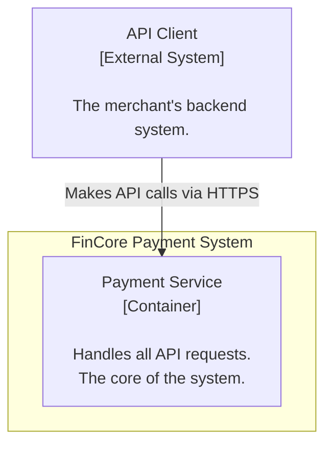
```mermaid
graph TD
    subgraph "FinCore Payment System"
        payment_service["Payment Service<br>[Container]<br><br>Handles all API requests.<br>The core of the system."]
    end

    api_client["API Client<br>[External System]<br><br>The merchant's backend system."]

    api_client -- "Makes API calls via HTTPS" --> payment_service
```

### Milestone 02: Architect the PSP Integration Layer for a Single Provider

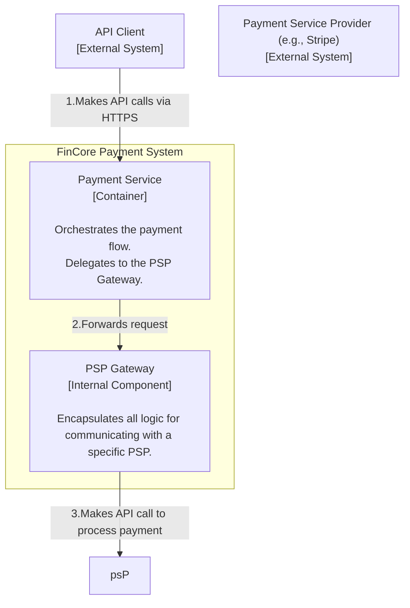
```mermaid
graph TD
    subgraph "FinCore Payment System"
        payment_service["Payment Service<br>[Container]<br><br>Orchestrates the payment flow.<br>Delegates to the PSP Gateway."]
        psp_gateway["PSP Gateway<br>[Internal Component]<br><br>Encapsulates all logic for communicating with a specific PSP."]
    end

    api_client["API Client<br>[External System]"]
    psp["Payment Service Provider (e.g., Stripe)<br>[External System]"]

    api_client -- "1.Makes API calls via HTTPS" --> payment_service
    payment_service -- "2.Forwards request" --> psp_gateway
    psp_gateway -- "3.Makes API call to process payment" --> psP
```

### Milestone 03: Architect the Secure Client-Side Tokenization Flow

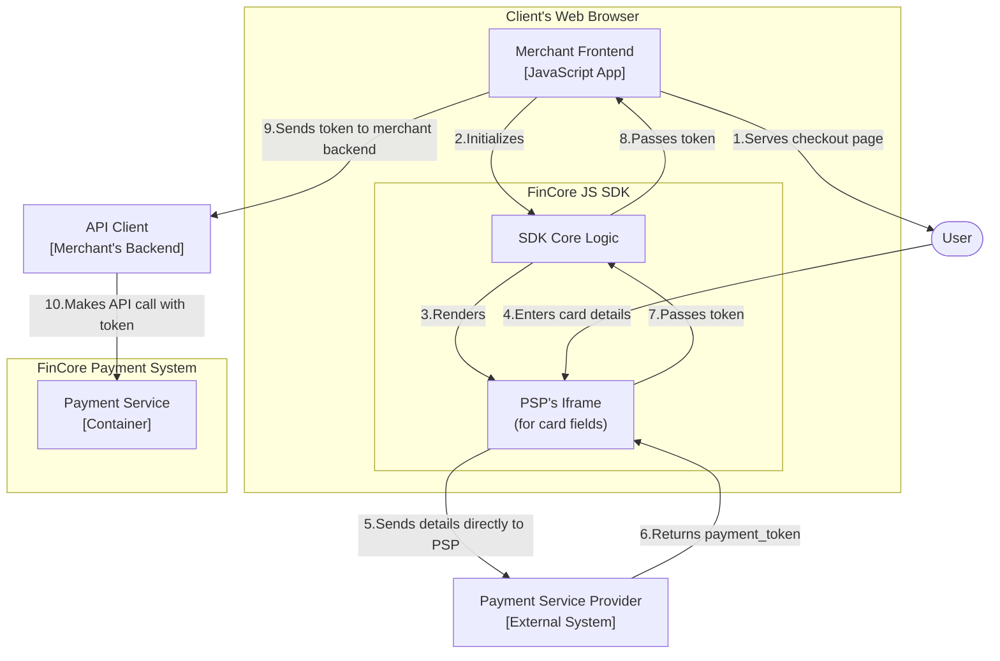
```mermaid
graph TD
    subgraph "Client's Web Browser"
        merchant_frontend["Merchant Frontend<br>[JavaScript App]"]
        
        subgraph "FinCore JS SDK"
            direction LR
            sdk_core["SDK Core Logic"]
            psp_iframe["PSP's Iframe<br>(for card fields)"]
        end

        merchant_frontend -- "2.Initializes" --> sdk_core
        sdk_core -- "3.Renders" --> psp_iframe
    end

    subgraph "FinCore Payment System"
        payment_service["Payment Service<br>[Container]"]
    end

    api_client["API Client<br>[Merchant's Backend]"]
    psp["Payment Service Provider<br>[External System]"]

    merchant_frontend -- "1.Serves checkout page" --> User([User])
    User -- "4.Enters card details" --> psp_iframe
    psp_iframe -- "5.Sends details directly to PSP" --> psp
    psp -- "6.Returns payment_token" --> psp_iframe
    psp_iframe -- "7.Passes token" --> sdk_core
    sdk_core -- "8.Passes token" --> merchant_frontend
    merchant_frontend -- "9.Sends token to merchant backend" --> api_client
    api_client -- "10.Makes API call with token" --> payment_service
```

### Milestone 04: Architect the Foundational Data Model and State Machine

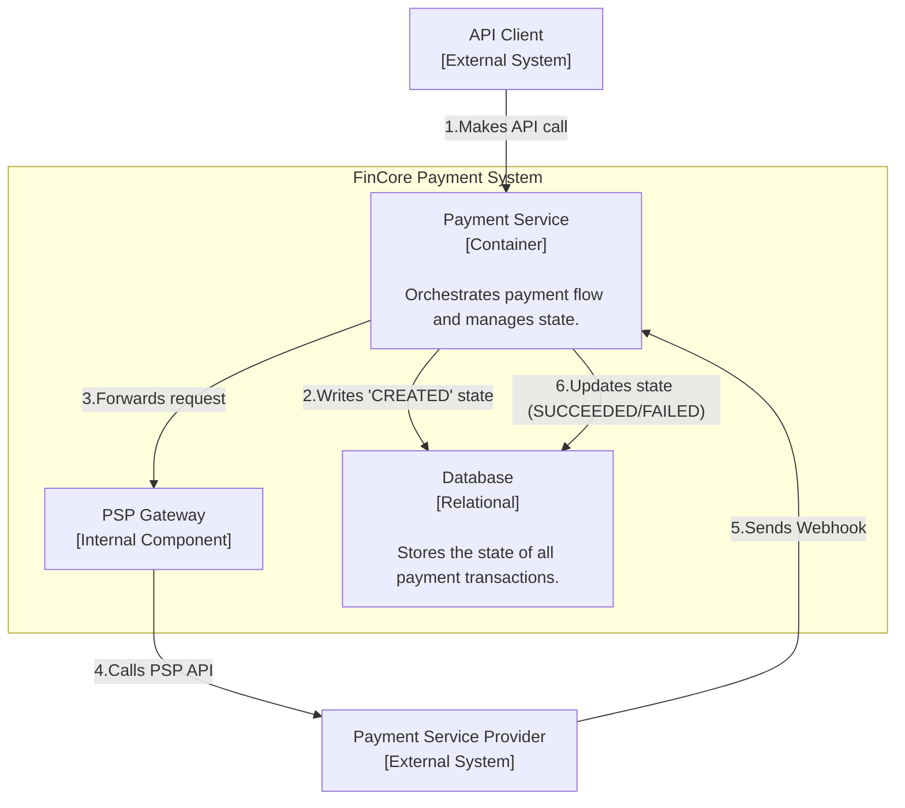
```mermaid
graph TD
    subgraph "FinCore Payment System"
        payment_service["Payment Service<br>[Container]<br><br>Orchestrates payment flow and manages state."]
        psp_gateway["PSP Gateway<br>[Internal Component]"]
        db["Database<br>[Relational]<br><br>Stores the state of all payment transactions."]
    end

    api_client["API Client<br>[External System]"]
    psp["Payment Service Provider<br>[External System]"]

    api_client -- "1.Makes API call" --> payment_service
    payment_service -- "2.Writes 'CREATED' state" --> db
    payment_service -- "3.Forwards request" --> psp_gateway
    psp_gateway -- "4.Calls PSP API" --> psp
    psp -- "5.Sends Webhook" --> payment_service
    payment_service -- "6.Updates state (SUCCEEDED/FAILED)" --> db
```

### Milestone 05: Architect a Secure and Reliable PSP Webhook Handler

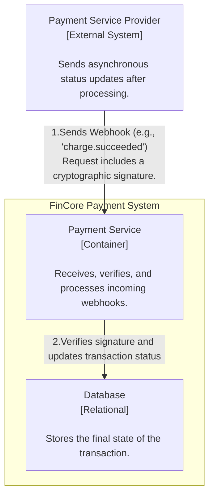
```mermaid
graph TD
    subgraph "FinCore Payment System"
        payment_service["Payment Service<br>[Container]<br><br>Receives, verifies, and processes incoming webhooks."]
        db["Database<br>[Relational]<br><br>Stores the final state of the transaction."]
    end

    psp["Payment Service Provider<br>[External System]<br><br>Sends asynchronous status updates after processing."]

    psp -- "1.Sends Webhook (e.g., 'charge.succeeded')<br>Request includes a cryptographic signature." --> payment_service
    payment_service -- "2.Verifies signature and updates transaction status" --> db
```

### Milestone 06: Architect the API Idempotency Layer for Safe Retries

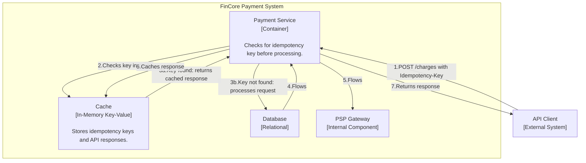
```mermaid
graph TD
    subgraph "FinCore Payment System"
        payment_service["Payment Service<br>[Container]<br><br>Checks for idempotency key before processing."]
        cache["Cache<br>[In-Memory Key-Value]<br><br>Stores idempotency keys and API responses."]
        db["Database<br>[Relational]"]
        psp_gateway["PSP Gateway<br>[Internal Component]"]
    end

    api_client["API Client<br>[External System]"]
    
    api_client -- "1.POST /charges with Idempotency-Key" --> payment_service
    payment_service -- "2.Checks key in cache" --> cache
    cache -- "3a.Key found: returns cached response" --> payment_service
    payment_service -- "3b.Key not found: processes request" --> db
    db -- "4.Flows" --> payment_service
    payment_service -- "5.Flows" --> psp_gateway
    payment_service -- "6.Caches response" --> cache
    payment_service -- "7.Returns response" --> api_client
```

### Milestone 07: Architect a Resilient Asynchronous Processing and Retry Mechanism

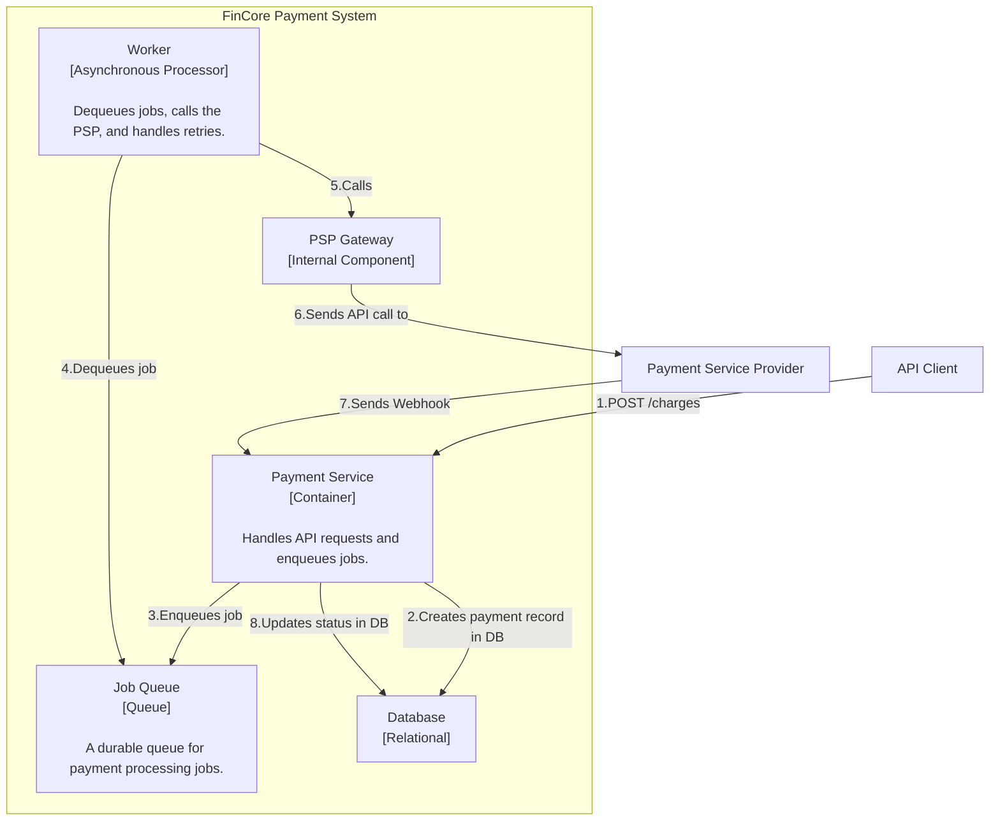
```mermaid
graph TD
    subgraph "FinCore Payment System"
        payment_service["Payment Service<br>[Container]<br><br>Handles API requests and enqueues jobs."]
        job_queue["Job Queue<br>[Queue]<br><br>A durable queue for payment processing jobs."]
        worker["Worker<br>[Asynchronous Processor]<br><br>Dequeues jobs, calls the PSP, and handles retries."]
        psp_gateway["PSP Gateway<br>[Internal Component]"]
        db["Database<br>[Relational]"]
    end

    api_client["API Client"]
    psp["Payment Service Provider"]

    api_client -- "1.POST /charges" --> payment_service
    payment_service -- "2.Creates payment record in DB" --> db
    payment_service -- "3.Enqueues job" --> job_queue
    
    worker -- "4.Dequeues job" --> job_queue
    worker -- "5.Calls" --> psp_gateway
    psp_gateway -- "6.Sends API call to" --> psp
    
    psp -- "7.Sends Webhook" --> payment_service
    payment_service -- "8.Updates status in DB" --> db
```

### Milestone 08: Architect the Payment Query API and an Internal Dashboard

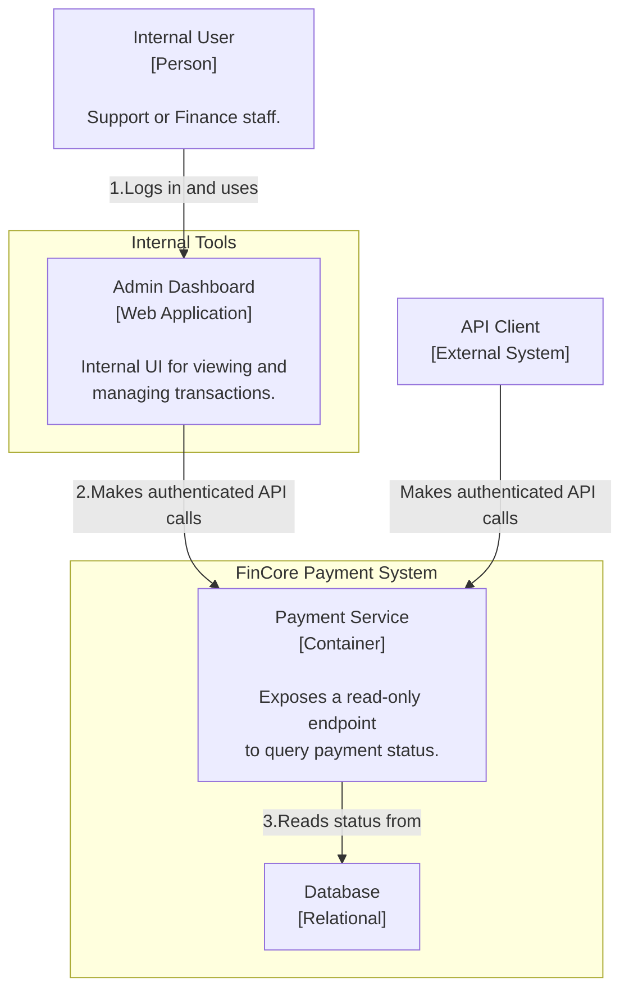
```mermaid
graph TD
    subgraph "FinCore Payment System"
        payment_service["Payment Service<br>[Container]<br><br>Exposes a read-only endpoint<br>to query payment status."]
        db["Database<br>[Relational]"]
    end
    
    subgraph "Internal Tools"
        admin_dashboard["Admin Dashboard<br>[Web Application]<br><br>Internal UI for viewing and<br>managing transactions."]
    end

    api_client["API Client<br>[External System]"]
    internal_user["Internal User<br>[Person]<br><br>Support or Finance staff."]

    internal_user -- "1.Logs in and uses" --> admin_dashboard
    admin_dashboard -- "2.Makes authenticated API calls" --> payment_service
    api_client -- "Makes authenticated API calls" --> payment_service
    
    payment_service -- "3.Reads status from" --> db
```

### Milestone 09: Architect Refunding Capabilities

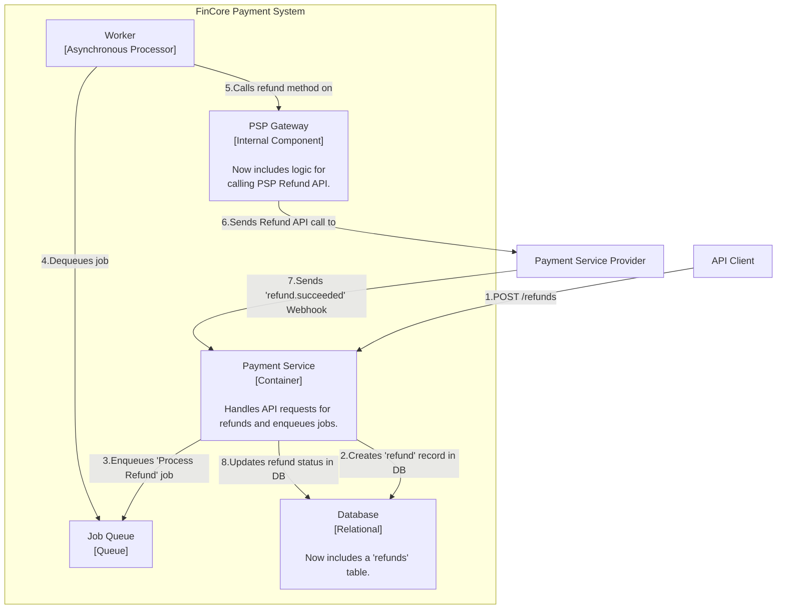
```mermaid
graph TD
    subgraph "FinCore Payment System"
        payment_service["Payment Service<br>[Container]<br><br>Handles API requests for refunds and enqueues jobs."]
        job_queue["Job Queue<br>[Queue]"]
        worker["Worker<br>[Asynchronous Processor]"]
        psp_gateway["PSP Gateway<br>[Internal Component]<br><br>Now includes logic for<br>calling PSP Refund API."]
        db["Database<br>[Relational]<br><br>Now includes a 'refunds' table."]
    end

    api_client["API Client"]
    psp["Payment Service Provider"]

    api_client -- "1.POST /refunds" --> payment_service
    payment_service -- "2.Creates 'refund' record in DB" --> db
    payment_service -- "3.Enqueues 'Process Refund' job" --> job_queue
    
    worker -- "4.Dequeues job" --> job_queue
    worker -- "5.Calls refund method on" --> psp_gateway
    psp_gateway -- "6.Sends Refund API call to" --> psp
    
    psp -- "7.Sends 'refund.succeeded' Webhook" --> payment_service
    payment_service -- "8.Updates refund status in DB" --> db
```

### Milestone 10: Architect the System around an Event-Sourced Ledger

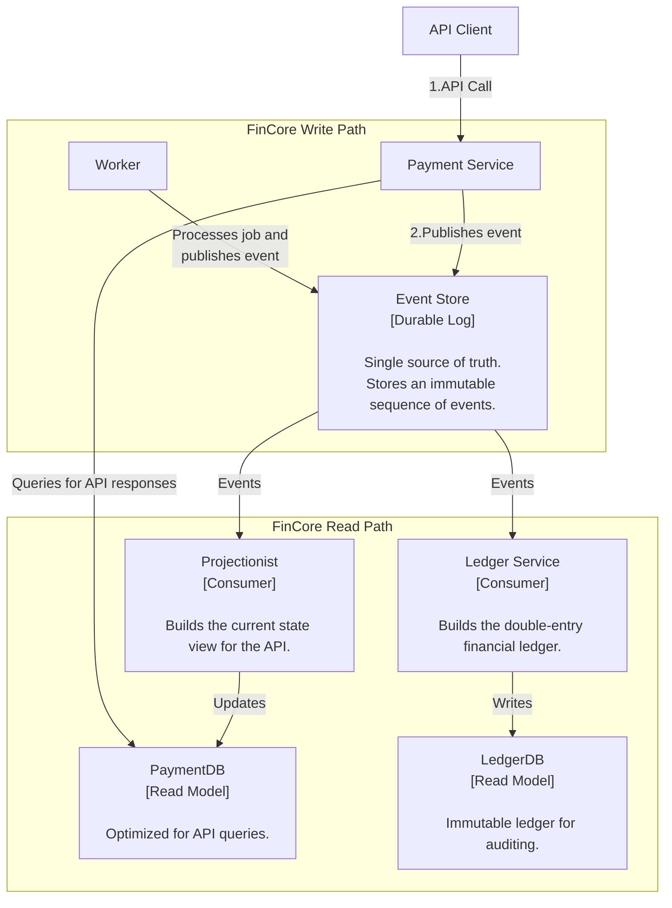
```mermaid
graph TD
    subgraph "FinCore Write Path"
        payment_service["Payment Service"]
        worker["Worker"]
        event_store["Event Store<br>[Durable Log]<br><br>Single source of truth.<br>Stores an immutable sequence of events."]
    end

    subgraph "FinCore Read Path"
        projectionist["Projectionist<br>[Consumer]<br><br>Builds the current state view for the API."]
        ledger_service["Ledger Service<br>[Consumer]<br><br>Builds the double-entry financial ledger."]
        payment_db["PaymentDB<br>[Read Model]<br><br>Optimized for API queries."]
        ledger_db["LedgerDB<br>[Read Model]<br><br>Immutable ledger for auditing."]
    end

    api_client["API Client"]

    api_client -- "1.API Call" --> payment_service
    payment_service -- "2.Publishes event" --> event_store
    worker -- "Processes job and<br>publishes event" --> event_store
    
    event_store -- "Events" --> projectionist
    projectionist -- "Updates" --> payment_db
    
    event_store -- "Events" --> ledger_service
    ledger_service -- "Writes" --> ledger_db

    payment_service -- "Queries for API responses" --> payment_db
```

### Milestone 11: Architect the Automated Reconciliation Service

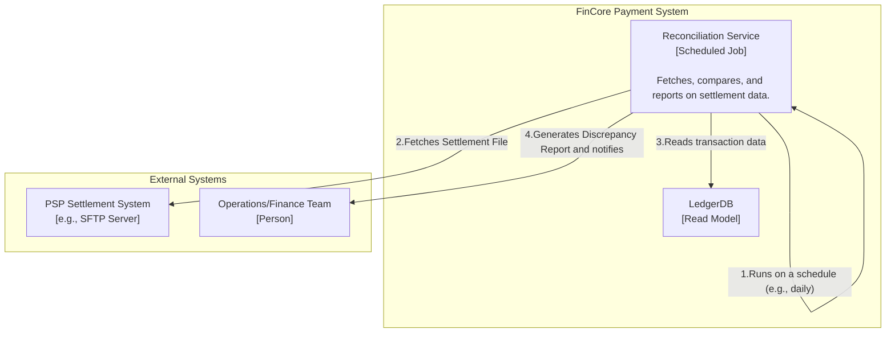
```mermaid
graph TD
    subgraph "FinCore Payment System"
        reconciliation_service["Reconciliation Service<br>[Scheduled Job]<br><br>Fetches, compares, and reports on settlement data."]
        ledger_db["LedgerDB<br>[Read Model]"]
    end

    subgraph "External Systems"
        psp_settlement["PSP Settlement System<br>[e.g., SFTP Server]"]
        ops_team["Operations/Finance Team<br>[Person]"]
    end
    
    reconciliation_service -- "1.Runs on a schedule (e.g., daily)" --> reconciliation_service
    reconciliation_service -- "2.Fetches Settlement File" --> psp_settlement
    reconciliation_service -- "3.Reads transaction data" --> ledger_db
    reconciliation_service -- "4.Generates Discrepancy Report and notifies" --> ops_team
```

### Milestone 12: Architect a Rule-Based Risk Engine for Fraud Detection

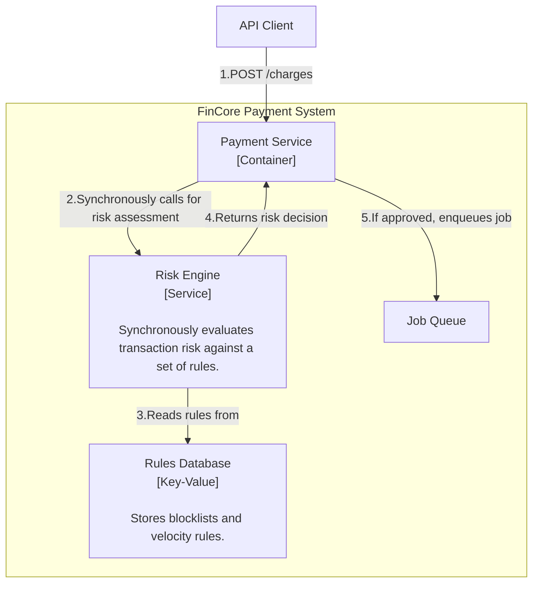
```mermaid
graph TD
    subgraph "FinCore Payment System"
        payment_service["Payment Service<br>[Container]"]
        risk_engine["Risk Engine<br>[Service]<br><br>Synchronously evaluates transaction risk against a set of rules."]
        rules_db["Rules Database<br>[Key-Value]<br><br>Stores blocklists and velocity rules."]
        job_queue["Job Queue"]
    end

    api_client["API Client"]

    api_client -- "1.POST /charges" --> payment_service
    payment_service -- "2.Synchronously calls for risk assessment" --> risk_engine
    risk_engine -- "3.Reads rules from" --> rules_db
    risk_engine -- "4.Returns risk decision" --> payment_service
    payment_service -- "5.If approved, enqueues job" --> job_queue
```

### Milestone 13: Architect Support for a Second Payment Service Provider

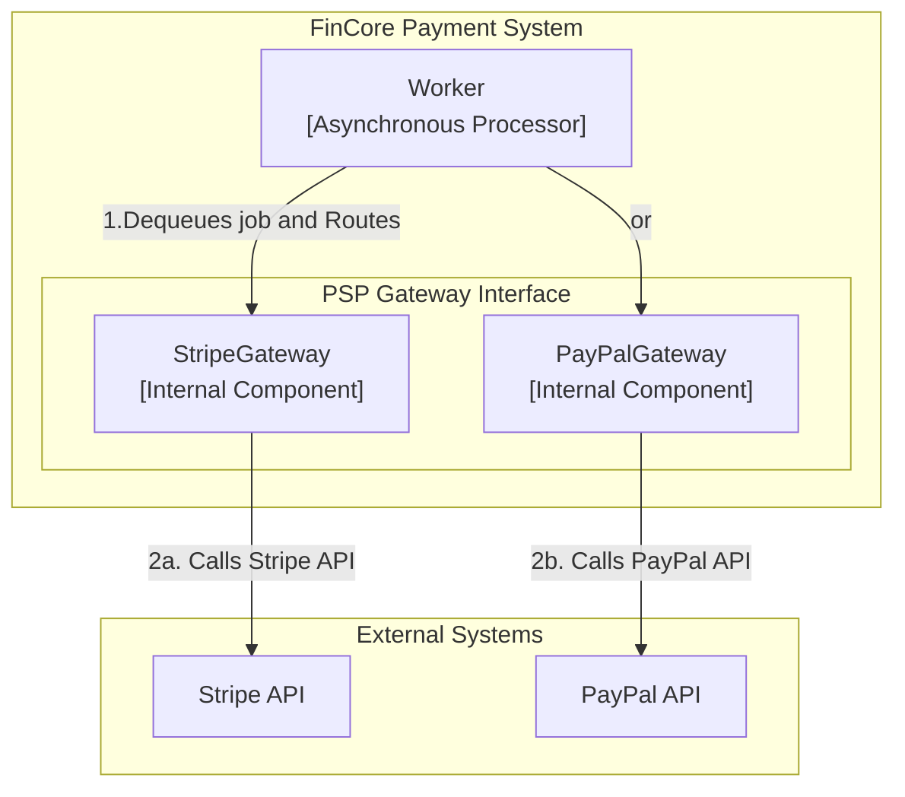
```mermaid
graph TD
    subgraph "FinCore Payment System"
        worker["Worker<br>[Asynchronous Processor]"]
        
        subgraph "PSP Gateway Interface"
            direction LR
            stripe_gateway["StripeGateway<br>[Internal Component]"]
            paypal_gateway["PayPalGateway<br>[Internal Component]"]
        end
        
    end

    subgraph "External Systems"
        stripe["Stripe API"]
        paypal["PayPal API"]
    end

    worker -- "1.Dequeues job and Routes" --> stripe_gateway
    worker -- "or" --> paypal_gateway

    stripe_gateway -- "2a. Calls Stripe API" --> stripe
    paypal_gateway -- "2b. Calls PayPal API" --> paypal
```

### Milestone 14: Architect the Performance & Load Testing Framework

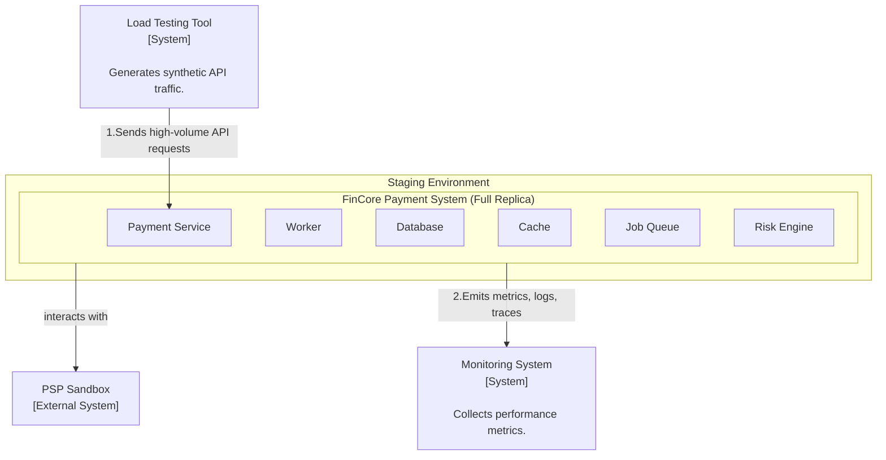
```mermaid
graph TD
    load_tester["Load Testing Tool<br>[System]<br><br>Generates synthetic API traffic."]
    
    subgraph staging_env["Staging Environment"]
        subgraph fincore_system["FinCore Payment System (Full Replica)"]
            payment_service["Payment Service"]
            worker["Worker"]
            db["Database"]
            cache["Cache"]
            queue["Job Queue"]
            risk_engine["Risk Engine"]
        end
    end

    monitoring["Monitoring System<br>[System]<br><br>Collects performance metrics."]
    psp_sandbox["PSP Sandbox<br>[External System]"]

    load_tester -- "1.Sends high-volume API requests" --> payment_service
    fincore_system -- interacts with --> psp_sandbox
    fincore_system -- "2.Emits metrics, logs, traces" --> monitoring
```

### Milestone 15: Architect a Comprehensive Monitoring, Alerting, and Logging Strategy

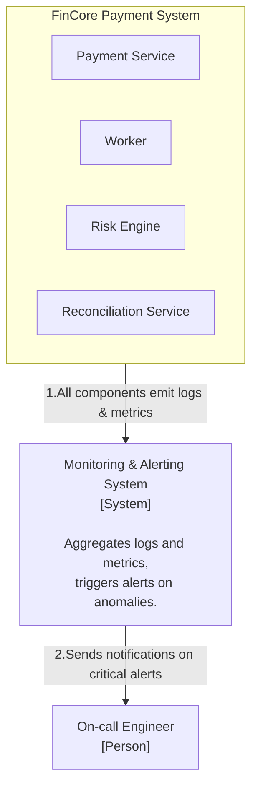
```mermaid
graph TD
    subgraph fincore_system["FinCore Payment System"]
        payment_service["Payment Service"]
        worker["Worker"]
        risk_engine["Risk Engine"]
        reco_service["Reconciliation Service"]
    end

    monitoring_system["Monitoring & Alerting System<br>[System]<br><br>Aggregates logs and metrics,<br>triggers alerts on anomalies."]
    
    on_call_engineer["On-call Engineer<br>[Person]"]

    fincore_system -- "1.All components emit logs & metrics" --> monitoring_system
    monitoring_system -- "2.Sends notifications on critical alerts" --> on_call_engineer
```

### Milestone 16: Architect Support for Hosted Redirect and Server-to-Server Integrations

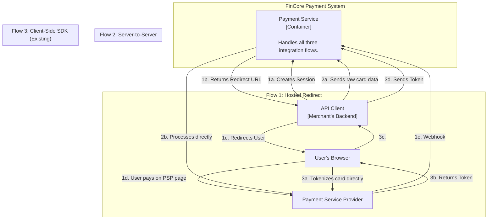
```mermaid
graph TD
    subgraph "FinCore Payment System"
        payment_service["Payment Service<br>[Container]<br><br>Handles all three integration flows."]
    end

    api_client["API Client<br>[Merchant's Backend]"]
    user_browser["User's Browser"]
    psp["Payment Service Provider"]

    subgraph "Flow 1: Hosted Redirect"
        direction LR
        api_client -- "1a. Creates Session" --> payment_service
        payment_service -- "1b. Returns Redirect URL" --> api_client
        api_client -- "1c. Redirects User" --> user_browser
        user_browser -- "1d. User pays on PSP page" --> psp
        psp -- "1e. Webhook" --> payment_service
    end

    subgraph "Flow 2: Server-to-Server"
        direction LR
        api_client -- "2a. Sends raw card data" --> payment_service
        payment_service -- "2b. Processes directly" --> psp
    end
    
    subgraph "Flow 3: Client-Side SDK (Existing)"
        direction LR
        user_browser -- "3a. Tokenizes card directly" --> psp
        psp -- "3b. Returns Token" --> user_browser
        user_browser -- "3c. " --> api_client
        api_client -- "3d. Sends Token" --> payment_service
    end
```

### Overall Logical View

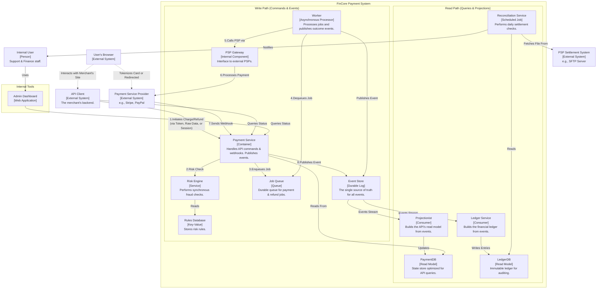
```mermaid
graph TD
    %% Define Actors and External Systems
    api_client["API Client<br>[External System]<br>The merchant's backend."]
    user_browser["User's Browser<br>[External System]"]
    internal_user["Internal User<br>[Person]<br>Support & Finance staff."]
    psp["Payment Service Provider<br>[External System]<br>e.g., Stripe, PayPal"]
    psp_settlement["PSP Settlement System<br>[External System]<br>e.g., SFTP Server"]

    %% --- System Boundaries ---
    subgraph fincore_system["FinCore Payment System"]
        direction LR

        subgraph write_path["Write Path (Commands & Events)"]
            direction TB
            payment_service["Payment Service<br>[Container]<br>Handles API commands & webhooks. Publishes events."]
            risk_engine["Risk Engine<br>[Service]<br>Performs synchronous fraud checks."]
            rules_db["Rules Database<br>[Key-Value]<br>Stores risk rules."]
            job_queue["Job Queue<br>[Queue]<br>Durable queue for payment & refund jobs."]
            worker["Worker<br>[Asynchronous Processor]<br>Processes jobs and publishes outcome events."]
            event_store["Event Store<br>[Durable Log]<br>The single source of truth for all events."]
            psp_gateway["PSP Gateway<br>[Internal Component]<br>Interface to external PSPs."]
        end
        
        subgraph read_path["Read Path (Queries & Projections)"]
            direction TB
            projectionist["Projectionist<br>[Consumer]<br>Builds the API's read model from events."]
            ledger_service["Ledger Service<br>[Consumer]<br>Builds the financial ledger from events."]
            payment_db["PaymentDB<br>[Read Model]<br>State store optimized for API queries."]
            ledger_db["LedgerDB<br>[Read Model]<br>Immutable ledger for auditing."]
            reconciliation_service["Reconciliation Service<br>[Scheduled Job]<br>Performs daily settlement checks."]
        end
    end

    subgraph internal_tools["Internal Tools"]
        admin_dashboard["Admin Dashboard<br>[Web Application]"]
    end

    %% --- Interactions ---

    %% Write Path / Command Flow
    api_client -- "1.Initiates Charge/Refund<br>(via Token, Raw Data, or Session)" --> payment_service
    payment_service -- "2.Risk Check" --> risk_engine
    risk_engine -- "Reads" --> rules_db
    payment_service -- "3.Enqueues Job" --> job_queue
    worker -- "4.Dequeues Job" --> job_queue
    worker -- "5.Calls PSP via" --> psp_gateway
    psp_gateway -- "6.Processes Payment" --> psp
    psp -- "7.Sends Webhook" --> payment_service
    payment_service -- "8.Publishes Event" --> event_store
    worker -- "Publishes Event" --> event_store
    
    %% Read Path / Query & Projection Flow
    event_store -- "Events Stream" --> projectionist
    projectionist -- "Updates" --> payment_db
    event_store -- "Events Stream" --> ledger_service
    ledger_service -- "Writes Entries" --> ledger_db
    
    %% Query & Internal Tool Flow
    api_client -- "Queries Status" --> payment_service
    admin_dashboard -- "Queries Status" --> payment_service
    payment_service -- "Reads From" --> payment_db
    internal_user -- "Uses" --> admin_dashboard
    
    %% Reconciliation Flow
    reconciliation_service -- "Reads" --> ledger_db
    reconciliation_service -- "Fetches File From" --> psp_settlement
    reconciliation_service -- "Notifies" --> internal_user

    %% Client-Side Flows (Conceptual)
    user_browser -. "Interacts with Merchant's Site" .-> api_client
    user_browser -. "Tokenizes Card or Redirected" .-> psp
```

## Physical View (AWS Deployment Diagram)

### Milestone 01: Architect the Core Service and Foundational API Structure

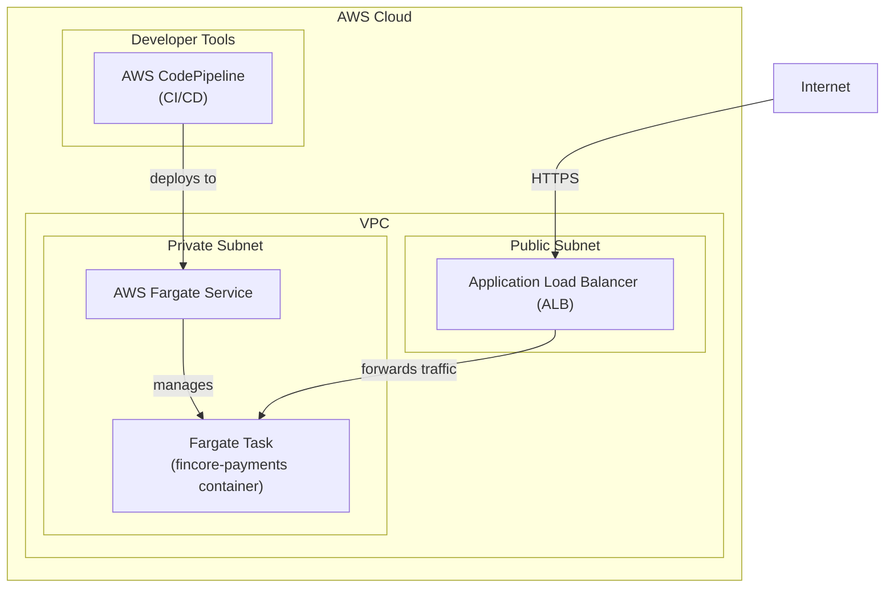
```mermaid
graph TD
    subgraph "AWS Cloud"
        subgraph "VPC"
            subgraph "Public Subnet"
                alb["Application Load Balancer (ALB)"]
            end

            subgraph "Private Subnet"
                fargate_service["AWS Fargate Service"]
                task["Fargate Task<br>(fincore-payments container)"]
                fargate_service -- "manages" --> task
            end
        end

        subgraph "Developer Tools"
            codepipeline["AWS CodePipeline<br>(CI/CD)"]
        end
    end

    internet["Internet"]

    internet -- "HTTPS" --> alb
    alb -- "forwards traffic" --> task
    codepipeline -- "deploys to" --> fargate_service
```

### Milestone 02: Architect the PSP Integration Layer for a Single Provider

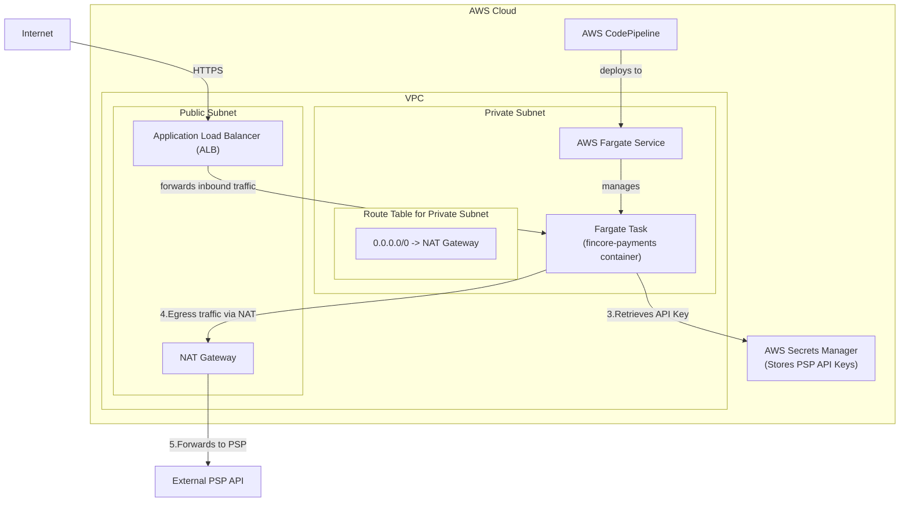
```mermaid
graph TD
    subgraph "AWS Cloud"
        subgraph "VPC"
            subgraph "Public Subnet"
                alb["Application Load Balancer (ALB)"]
                nat["NAT Gateway"]
            end

            subgraph "Private Subnet"
                fargate_service["AWS Fargate Service"]
                task["Fargate Task<br>(fincore-payments container)"]
                fargate_service -- "manages" --> task

                subgraph "Route Table for Private Subnet"
                    route["0.0.0.0/0 -> NAT Gateway"]
                end
            end
        end

        secrets_manager["AWS Secrets Manager<br>(Stores PSP API Keys)"]
        codepipeline["AWS CodePipeline"]
    end

    internet["Internet"]
    psp_api["External PSP API"]

    internet -- "HTTPS" --> alb
    alb -- "forwards inbound traffic" --> task
    task -- "3.Retrieves API Key" --> secrets_manager
    task -- "4.Egress traffic via NAT" --> nat
    nat -- "5.Forwards to PSP" --> psp_api
    codepipeline -- "deploys to" --> fargate_service
```

### Milestone 03: Architect the Secure Client-Side Tokenization Flow

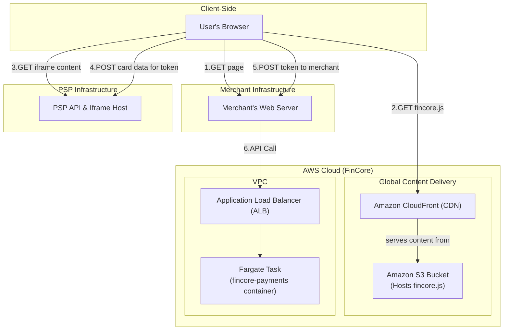
```mermaid
graph TD
    subgraph "Client-Side"
        browser["User's Browser"]
    end
    
    subgraph "AWS Cloud (FinCore)"
        subgraph "Global Content Delivery"
            cdn["Amazon CloudFront (CDN)"]
            s3["Amazon S3 Bucket<br>(Hosts fincore.js)"]
            cdn -- "serves content from" --> s3
        end

        subgraph "VPC"
            alb["Application Load Balancer (ALB)"]
            task["Fargate Task<br>(fincore-payments container)"]
            alb --> task
        end
    end

    subgraph "Merchant Infrastructure"
        merchant_server["Merchant's Web Server"]
    end

    subgraph "PSP Infrastructure"
        psp_api["PSP API & Iframe Host"]
    end

    browser -- "1.GET page" --> merchant_server
    browser -- "2.GET fincore.js" --> cdn
    browser -- "3.GET iframe content" --> psp_api
    browser -- "4.POST card data for token" --> psp_api
    browser -- "5.POST token to merchant" --> merchant_server
    merchant_server -- "6.API Call" --> alb
```

### Milestone 04: Architect the Foundational Data Model and State Machine

```mermaid
graph TD
    subgraph "AWS Cloud"
        subgraph "VPC"
            subgraph "Public Subnet"
                alb["Application Load Balancer (ALB)"]
                nat["NAT Gateway"]
            end

            subgraph "Private Subnet (Application)"
                fargate_service["AWS Fargate Service"]
                task["Fargate Task<br>(fincore-payments container)"]
                fargate_service -- "manages" --> task
            end
            
            subgraph "Private Subnet (Database)"
                rds["Amazon RDS<br>PostgreSQL Instance"]
            end
        end

        secrets_manager["AWS Secrets Manager"]
    end

    psp_api["External PSP API"]

    alb -- "inbound traffic" --> task
    task -- "reads/writes" --> rds
    task -- "retrieves secrets" --> secrets_manager
    task -- "outbound traffic" --> nat --> psp_api
```

### Milestone 05: Architect a Secure and Reliable PSP Webhook Handler

```mermaid
graph TD
    subgraph "AWS Cloud"
        subgraph "VPC"
            subgraph "Public Subnet"
                alb["Application Load Balancer (ALB)"]
            end

            subgraph "Private Subnet"
                fargate_service["AWS Fargate Service"]
                task["Fargate Task<br>(fincore-payments container)"]
                fargate_service -- "manages" --> task
                
                rds["Amazon RDS<br>PostgreSQL Instance"]
            end
        end

        secrets_manager["AWS Secrets Manager<br>(Stores PSP API Keys & Webhook Secrets)"]
    end

    internet["Internet"]
    psp_api["External PSP System"]

    internet -- "HTTPS Inbound" --> alb
    alb -- "forwards webhook traffic" --> task
    task -- "1.Retrieves Webhook Secret" --> secrets_manager
    task -- "2.Reads/Writes to DB" --> rds
```

### Milestone 06: Architect the API Idempotency Layer for Safe Retries

```mermaid
graph TD
    subgraph "AWS Cloud"
        subgraph "VPC"
            subgraph "Public Subnet"
                alb["Application Load Balancer (ALB)"]
            end

            subgraph "Private Subnet (Application)"
                fargate_service["AWS Fargate Service"]
                task["Fargate Task<br>(fincore-payments container)"]
                fargate_service -- "manages" --> task
            end
            
            subgraph "Private Subnet (Database)"
                rds["Amazon RDS<br>PostgreSQL Instance"]
                redis["Amazon ElastiCache<br>for Redis Cluster"]
            end
        end
    end

    alb -- "inbound traffic" --> task
    task -- "reads/writes payment state" --> rds
    task -- "checks/writes idempotency keys" --> redis
```

### Milestone 07: Architect a Resilient Asynchronous Processing and Retry Mechanism

```mermaid
graph TD
    subgraph "AWS Cloud"
        subgraph "VPC"
            subgraph "Public Subnet"
                alb["Application Load Balancer (ALB)"]
            end

            subgraph "Private Subnet (Application)"
                fargate_service["AWS Fargate Service"]
                task["Fargate Task<br>(Payment Service)"]
                fargate_service -- "manages" --> task

                sqs["Amazon SQS Queue"]
                dlq["SQS Dead Letter Queue (DLQ)"]
                sqs -- "on failure" --> dlq

                lambda_worker["AWS Lambda Function<br>(Worker)"]
                lambda_worker -- "triggered by" --> sqs
            end
            
            subgraph "Private Subnet (Database)"
                rds["Amazon RDS"]
                redis["Amazon ElastiCache"]
            end
        end
    end

    alb -- "inbound traffic" --> task
    task -- "enqueues to" --> sqs
    lambda_worker -- "reads/writes to" --> rds
    lambda_worker -- "reads/writes to" --> redis
```

### Milestone 08: Architect the Payment Query API and an Internal Dashboard

```mermaid
graph TD
    subgraph "AWS Cloud"
        subgraph "Global Content Delivery"
            cdn["Amazon CloudFront (CDN)<br>for Admin Dashboard"]
            s3["Amazon S3 Bucket<br>(Hosts Admin SPA)"]
            cdn -- "serves content from" --> s3
        end
        
        subgraph "VPC"
            alb["Application Load Balancer (ALB)"]
            task["Fargate Task<br>(Payment Service)"]
            alb -- "forwards API traffic" --> task
        end
        
        cognito["AWS Cognito<br>User Pool"]
    end

    browser["User's Browser"]

    browser -- "1.Authenticates with" --> cognito
    cognito -- "2.Returns JWT" --> browser
    browser -- "3.GET assets" --> cdn
    browser -- "4.Makes API call with JWT" --> alb
```

### Milestone 09: Architect Refunding Capabilities

```mermaid
graph TD
    subgraph "AWS Cloud"
        subgraph "VPC"
            subgraph "Private Subnet (Application)"
                fargate_service["AWS Fargate Service"]
                task["Fargate Task<br>(Payment Service)<br>+ /refunds endpoint"]
                fargate_service -- "manages" --> task

                sqs["Amazon SQS Queue<br>Handles charge & refund jobs"]
                
                lambda_worker["AWS Lambda Function<br>(Worker)<br>+ refund processing logic"]
                lambda_worker -- "triggered by" --> sqs
            end
            
            subgraph "Private Subnet (Database)"
                rds["Amazon RDS<br>+ refunds table"]
            end
        end
    end

    task -- "enqueues to" --> sqs
    lambda_worker -- "reads/writes to" --> rds
```

### Milestone 10: Architect the System around an Event-Sourced Ledger

```mermaid
graph TD
    subgraph "AWS Cloud"
        subgraph "VPC"
            subgraph "Private Subnet (Application)"
                fargate_task["Fargate Task<br>(Payment Service)"]
                lambda_worker["AWS Lambda Function<br>(Worker)"]
                
                projectionist_lambda["AWS Lambda Function<br>(Projectionist)"]
                ledger_lambda["AWS Lambda Function<br>(Ledger Service)"]
            end
            
            subgraph "Private Subnet (Database)"
                rds_payment["Amazon RDS<br>PaymentDB (Read Model)"]
                rds_ledger["Amazon RDS<br>LedgerDB (Read Model)"]
            end
        end

        kinesis["Amazon Kinesis Data Stream<br>(Event Store)"]

        fargate_task -- "writes to" --> kinesis
        lambda_worker -- "writes to" --> kinesis
        
        projectionist_lambda -- "triggered by" --> kinesis
        projectionist_lambda -- "updates" --> rds_payment
        
        ledger_lambda -- "triggered by" --> kinesis
        ledger_lambda -- "writes to" --> rds_ledger
    end
```

### Milestone 11: Architect the Automated Reconciliation Service

```mermaid
graph TD
    subgraph "AWS Cloud"
        eventbridge["Amazon EventBridge<br>(Scheduled Rule: e.g., 'cron(0 2 * * ? *)')"]

        subgraph "VPC"
            subgraph "Private Subnet (Application)"
                reco_lambda["AWS Lambda Function<br>(Reconciliation Service)"]
            end
            
            subgraph "Private Subnet (Database)"
                rds_ledger["Amazon RDS<br>(LedgerDB)"]
            end
        end

        s3_reports["Amazon S3 Bucket<br>(for Discrepancy Reports)"]
        sns["Amazon SNS Topic<br>(for Notifications)"]
    end

    psp_sftp["External PSP SFTP Server"]

    eventbridge -- "1.Triggers" --> reco_lambda
    reco_lambda -- "2.Fetches file from" --> psp_sftp
    reco_lambda -- "3.Reads from" --> rds_ledger
    reco_lambda -- "4.Writes report to" --> s3_reports
    reco_lambda -- "5.Publishes notification to" --> sns
```

### Milestone 12: Architect a Rule-Based Risk Engine for Fraud Detection

```mermaid
graph TD
    subgraph "AWS Cloud"
        subgraph "VPC"
            subgraph "Private Subnet (Application)"
                fargate_task["Fargate Task<br>(Payment Service)"]
                risk_lambda["AWS Lambda Function<br>(Risk Engine)"]
            end
        end

        dynamodb["Amazon DynamoDB Table<br>(Rules Database)"]
    end

    fargate_task -- "synchronously invokes" --> risk_lambda
    risk_lambda -- "reads rules from" --> dynamodb
```

### Milestone 13: Architect Support for a Second Payment Service Provider

```mermaid
graph TD
    subgraph "AWS Cloud"
        subgraph "VPC"
            subgraph "Private Subnet (Application)"
                lambda_worker["AWS Lambda Function<br>(Worker)<br>+ Routing Logic<br>+ Stripe & PayPal Gateway Modules"]
            end
        end

        secrets_manager["AWS Secrets Manager<br>(Stores API keys and secrets for Stripe & PayPal)"]
    end

    psp_apis["External PSP APIs<br>(Stripe, PayPal, etc.)"]

    lambda_worker -- "1.Retrieves correct credentials" --> secrets_manager
    lambda_worker -- "2.Makes API calls to" --> psp_apis
```

### Milestone 14: Architect the Performance & Load Testing Framework

```mermaid
graph TD
    subgraph "AWS Cloud (Staging Account)"
        dlt["AWS Distributed Load Testing"]
        cloudwatch["Amazon CloudWatch<br>(Logs & Metrics)"]
        
        subgraph "Staging VPC"
            subgraph "Public Subnet"
                alb["ALB"]
            end
            
            subgraph "Private Subnet (App)"
                fargate_task["Fargate Task (Payment Service)"]
                lambda_worker["Lambda Worker"]
                sqs["SQS"]
            end

            subgraph "Private Subnet (DB)"
                rds["RDS"]
                redis["ElastiCache"]
            end
        end
    end

    dlt -- "1.Generates traffic to" --> alb
    
    subgraph "Observability"
        fargate_task -- sends logs/metrics --> cloudwatch
        lambda_worker -- sends logs/metrics --> cloudwatch
        rds -- sends metrics --> cloudwatch
        redis -- sends metrics --> cloudwatch
        sqs -- sends metrics --> cloudwatch
        alb -- sends logs/metrics --> cloudwatch
    end
```

### Milestone 15: Architect a Comprehensive Monitoring, Alerting, and Logging Strategy

```mermaid
graph TD
    subgraph "FinCore AWS Environment"
        subgraph "Application & Data Resources"
            alb["ALB"]
            fargate_task["Fargate Task"]
            lambda_functions["Lambda Functions"]
            sqs["SQS Queues"]
            rds["RDS Database"]
            kinesis["Kinesis Stream"]
        end

        subgraph "Observability Plane"
            cloudwatch["Amazon CloudWatch<br>(Logs, Metrics, Alarms, Dashboards)"]
            sns["Amazon SNS Topic"]
        end
    end

    subgraph "Notification Channels"
        pagerduty["PagerDuty"]
        email["Email"]
        slack["Slack"]
    end

    alb -- "sends logs/metrics" --> cloudwatch
    fargate_task -- "sends logs/metrics" --> cloudwatch
    lambda_functions -- "sends logs/metrics" --> cloudwatch
    sqs -- "sends metrics" --> cloudwatch
    rds -- "sends metrics" --> cloudwatch
    kinesis -- "sends metrics" --> cloudwatch

    cloudwatch -- "triggers alarms on" --> sns
    sns -- "notifies" --> pagerduty
    sns -- "notifies" --> email
    sns -- "notifies" --> slack
```

### Milestone 16: Architect Support for Hosted Redirect and Server-to-Server Integrations

```mermaid
graph TD
    subgraph "AWS Cloud"
        subgraph "VPC (Now a PCI-Compliant Environment)"
            subgraph "Public Subnet"
                alb["Application Load Balancer (ALB)"]
            end

            subgraph "Private Subnet (Application)"
                fargate_service["AWS Fargate Service"]
                task["Fargate Task<br>(Payment Service)<br><br><b>Scope Increased:</b><br>Now handles raw cardholder data.<br>Requires stricter security, logging, and auditing."]
                fargate_service -- "manages" --> task
            end
        end
    end

    api_client["Merchant's Backend"]
    user_browser["User's Browser"]
    psp_api["External PSP API"]

    api_client -- "Server-to-Server Flow (Raw Data)" --> alb
    user_browser -- "Redirect Flow" --> psp_api
    alb -- "forwards traffic" --> task
    task -- "calls" --> psp_api
```

### Physical View (AWS Deployment Diagram)

```mermaid
graph TD
    %% --- External Actors & Systems ---
    api_client["Merchant's Backend"]
    user_browser["User's Browser"]
    internal_user["Internal User"]
    psp_api["External PSP API"]
    psp_sftp["External PSP SFTP"]

    %% --- AWS Cloud Boundary ---
    subgraph aws_cloud["AWS Cloud"]
        
        %% --- Global & Non-VPC Services ---
        subgraph devops_and_delivery["DevOps & Global Delivery"]
            direction LR
            codepipeline["AWS CodePipeline"]
            cdn_sdk["CloudFront (for SDK)"]
            s3_sdk["S3 (for SDK)"]
            cdn_admin["CloudFront (for Admin UI)"]
            s3_admin["S3 (for Admin UI)"]
        end
        
        subgraph security_and_identity["Security & Identity"]
            direction LR
            cognito["AWS Cognito"]
            secrets_manager["AWS Secrets Manager"]
        end
        
        subgraph serverless_plane["Serverless Plane (Messaging & Data)"]
            direction TB
            kinesis["Amazon Kinesis<br>(Event Store)"]
            sqs["Amazon SQS<br>(Job Queue)"]
            dlq["SQS DLQ"]
            dynamodb["Amazon DynamoDB<br>(Rules DB)"]
        end

        subgraph notifications["Notifications"]
            direction LR
            eventbridge["Amazon EventBridge"]
            sns["Amazon SNS Topic"]
        end
        
        %% --- VPC Boundary ---
        subgraph vpc["VPC (PCI-Compliant Environment)"]
            subgraph public_subnet["Public Subnet"]
                alb["ALB"]
                nat["NAT Gateway"]
            end
            
            subgraph app_subnet["Private Subnet (Application)"]
                fargate_task["Fargate Task<br>(Payment Service)"]
                worker_lambda["Lambda<br>(Worker)"]
                risk_lambda["Lambda<br>(Risk Engine)"]
                projectionist_lambda["Lambda<br>(Projectionist)"]
                ledger_lambda["Lambda<br>(Ledger Service)"]
                reco_lambda["Lambda<br>(Reconciliation)"]
            end
            
            subgraph db_subnet["Private Subnet (Database)"]
                payment_db["RDS<br>(PaymentDB)"]
                ledger_db["RDS<br>(LedgerDB)"]
                redis["ElastiCache<br>(Idempotency)"]
            end
        end
    end

    %% --- Connections ---
    %% Inbound & UI
    api_client -- "API Calls" --> alb
    user_browser -- "Loads Merchant Site & SDK" --> cdn_sdk
    internal_user -- "Logs in" --> cognito
    internal_user -- "Loads Admin UI" --> cdn_admin
    cdn_sdk -- "serves" --> s3_sdk
    cdn_admin -- "serves" --> s3_admin
    alb -- "forwards to" --> fargate_task

    %% Write/Command Path
    fargate_task -- "Reads secrets" --> secrets_manager
    fargate_task -- "Invokes" --> risk_lambda
    fargate_task -- "Enqueues Job" --> sqs
    fargate_task -- "Publishes Event" --> kinesis
    risk_lambda -- "Reads rules" --> dynamodb
    worker_lambda -- "Triggered by" --> sqs
    worker_lambda -- "Reads secrets" --> secrets_manager
    worker_lambda -- "Calls out via" --> nat --> psp_api
    worker_lambda -- "Publishes Event" --> kinesis
    sqs --> dlq

    %% Read/Projection Path
    kinesis -- "Triggers" --> projectionist_lambda
    kinesis -- "Triggers" --> ledger_lambda
    projectionist_lambda -- "Writes to" --> payment_db
    ledger_lambda -- "Writes to" --> ledger_db
    fargate_task -- "Reads for queries" --> payment_db
    fargate_task -- "Reads/Writes idempotency keys" --> redis

    %% Reconciliation & Alerting
    eventbridge -- "Triggers" --> reco_lambda
    reco_lambda -- "Reads secrets" --> secrets_manager
    reco_lambda -- "Fetches file via" --> nat --> psp_sftp
    reco_lambda -- "Reads from" --> ledger_db
    reco_lambda -- "Publishes alert to" --> sns
    sns -- "Notifies" --> internal_user
```
