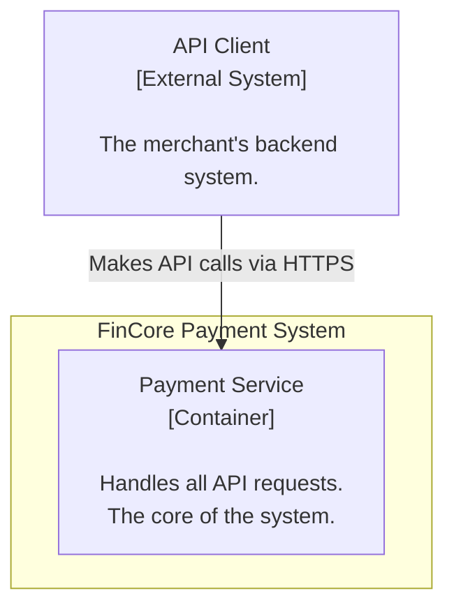
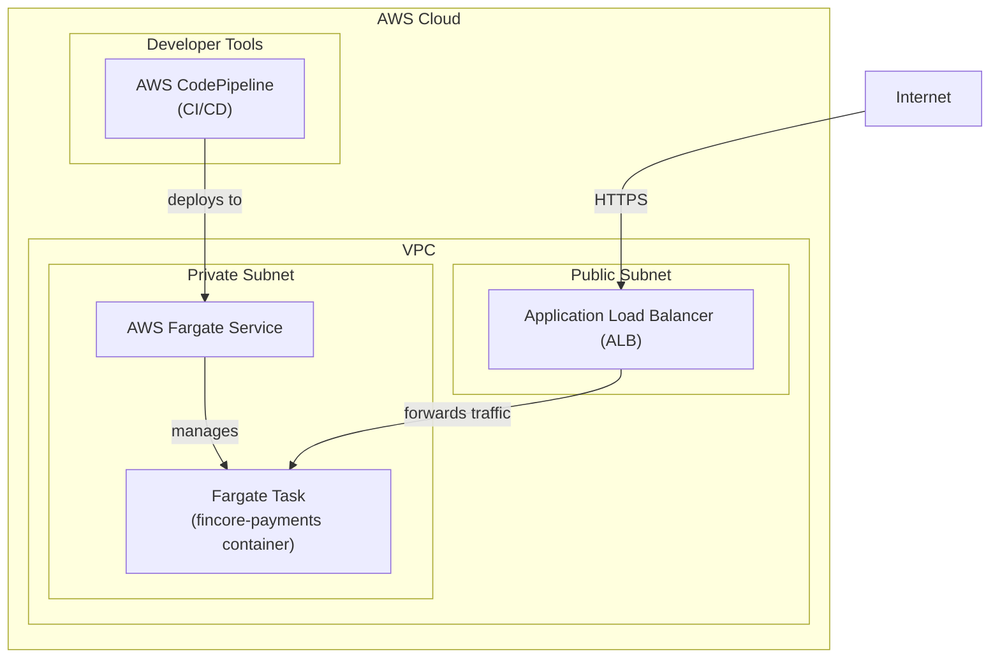

### **Architect the Core Service and Foundational API Structure**

*   **Problem:** Before any payment logic can be implemented, a foundational, deployable service must be established. We need a starting point that includes a basic application structure, a defined API, and an automated build/deployment process to enable rapid, iterative development.

*   **Solution:** Define a single, containerized "Payment Service" as the initial core of the FinCore system. This service will be responsible for handling all incoming API requests. The initial implementation will expose a simple `/health` endpoint to verify that the service is running. A basic CI/CD pipeline will be established to automatically build, test, and deploy this container to a development environment.

*   **Trade-offs:**
    *   **Monolith vs. Microservices:** We are starting with a single service (a monolith approach) for the MVP.
        *   **Pro:** This significantly simplifies initial development, deployment, and testing, allowing us to deliver a functional core faster.
        *   **Con:** As the system grows, this single service may become complex and harder to maintain. We are consciously accepting this trade-off now, with the understanding that we can refactor into microservices in later phases (e.g., separating the Risk Engine or Ledger Service) as complexity warrants.
    *   **Technology Stack:** The choice of a specific framework (e.g., FastAPI, Express) will influence hiring and development speed but is not critical to the high-level architecture at this stage.

---

#### **Logical View (C4 Component Diagram)**

This diagram shows the high-level logical structure. At this initial stage, we have an external actor (API Client) interacting with our system, which contains only one component.

---

#### **Physical View (AWS Deployment Diagram)**

This diagram maps the logical component to a concrete, container-based deployment on AWS. It shows how the container will be run and exposed to the internet.

---

#### **Component-to-Resource Mapping Table**

| Logical Component | Physical Resource | Rationale |
| :--- | :--- | :--- |
| **Payment Service** | **AWS Fargate Task** (running a Docker container) | **Serverless & Scalable:** Fargate is chosen to eliminate the need to manage underlying EC2 instances, simplifying operations. It allows the service to scale horizontally by automatically adding more tasks based on CPU/memory usage, which is ideal for handling variable payment traffic. |
| **(Entry Point)** | **Application Load Balancer (ALB)** | **Secure & Managed:** The ALB provides a secure, managed entry point for HTTPS traffic, handles TLS termination, and provides health checks and load balancing across multiple Fargate tasks, which is essential for reliability. |
| **(Deployment)** | **AWS CodePipeline** | **Automation:** A managed CI/CD service is chosen to automate the build, test, and deployment process, ensuring that every change is consistently and safely rolled out. |
