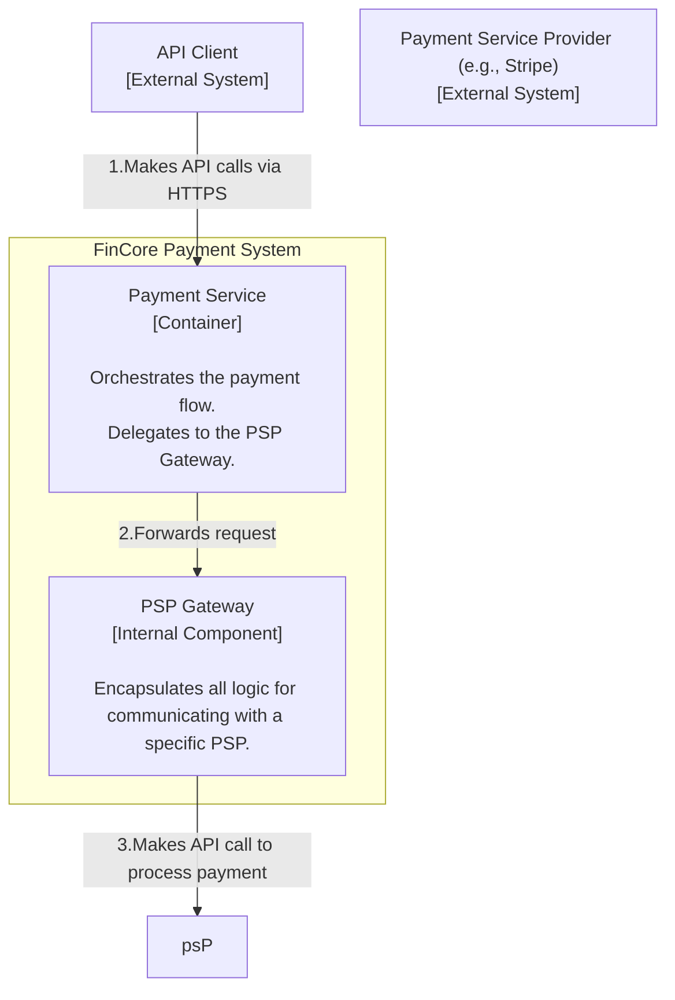
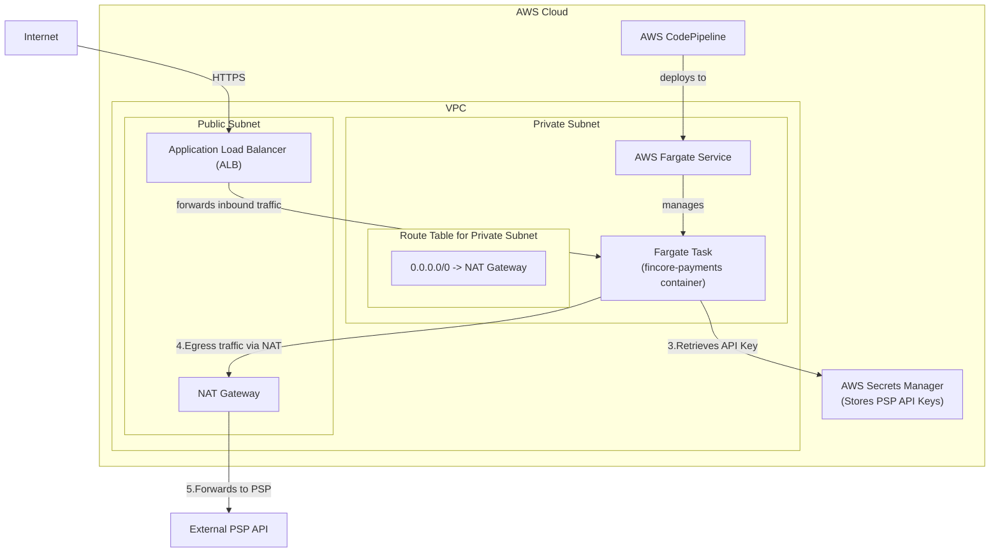

### **Architect the PSP Integration Layer for a Single Provider**

*   **Problem:** The `Payment Service` cannot process payments on its own. It needs a secure and standardized way to communicate with an external Payment Service Provider (PSP). A direct implementation would create tight coupling to a specific vendor (e.g., Stripe), making it difficult to add other providers or swap existing ones in the future.

*   **Solution:** Introduce a new logical component, the `PSP Gateway`, which will act as an "adapter" or "anti-corruption layer". This component will encapsulate all the logic required to interact with a specific PSP's API. The `Payment Service` will delegate all external payment processing calls to this gateway. Initially, this gateway will be implemented as a dedicated module *within* the `Payment Service` container, not as a separate microservice. We will also introduce a secure mechanism for managing the PSP's API keys.

*   **Trade-offs:**
    *   **Internal Module vs. Separate Microservice:**
        *   **Pro:** Implementing the gateway as an internal module is simpler for the MVP. It avoids the operational overhead of managing a separate service, CI/CD pipeline, and inter-service communication (which adds latency and complexity).
        *   **Con:** If the gateway logic becomes very complex or needs to be scaled independently from the main service, a separate microservice might be more appropriate. We are deliberately deferring this complexity.
    *   **Security of Credentials:** Storing API keys is a security risk.
        *   **Pro:** Using a dedicated secrets management service like AWS Secrets Manager is the most secure approach. It provides auditing, rotation, and fine-grained access control.
        *   **Con:** It adds a dependency on another AWS service and introduces a new potential point of failure. The alternative (e.g., environment variables) is simpler but less secure. We will choose the more secure path.

---

#### **Logical View (C4 Component Diagram)**

The logical view now evolves to show the new `PSP Gateway` component inside our system boundary. The `Payment Service` now depends on this gateway to interact with the external PSP.

---

#### **Physical View (AWS Deployment Diagram)**

The physical diagram is updated to show how the container, running in a private subnet, securely communicates with the external PSP on the internet. This requires adding a NAT Gateway. We also add AWS Secrets Manager for credential handling.

---

#### **Component-to-Resource Mapping Table**

| Logical Component | Physical Resource | Rationale |
| :--- | :--- | :--- |
| **Payment Service** | **AWS Fargate Task** (running a Docker container) | (Same as Issue #1) The core application logic runs here. |
| **PSP Gateway** | **AWS Fargate Task** (as a module within the same container) | For the MVP, the gateway logic co-exists in the same container to reduce operational complexity and latency. It is responsible for all outbound calls to the PSP. |
| **(Secure Egress)** | **NAT Gateway** | **Security:** A NAT Gateway allows the Fargate task in the private subnet to initiate outbound connections to the internet (e.g., to the PSP's API) without allowing inbound connections from the internet, maintaining a secure posture. |
| **(Secret Management)**| **AWS Secrets Manager** | **Security:** This is the best practice for storing sensitive credentials like API keys. It provides IAM-based access control, auditing, and key rotation capabilities, which are far more secure than using environment variables or config files. |
| **Payment Service Provider (PSP)** | **External SaaS** | This is a third-party system that we communicate with over the public internet. |
