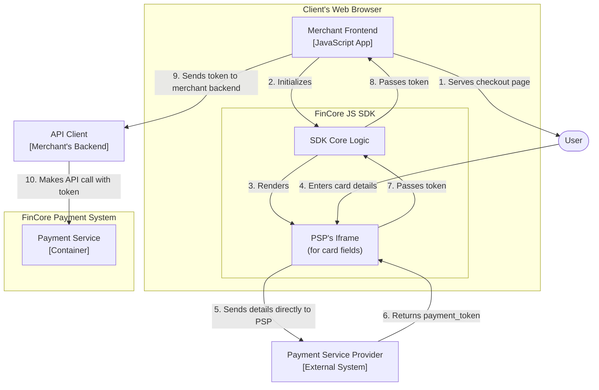
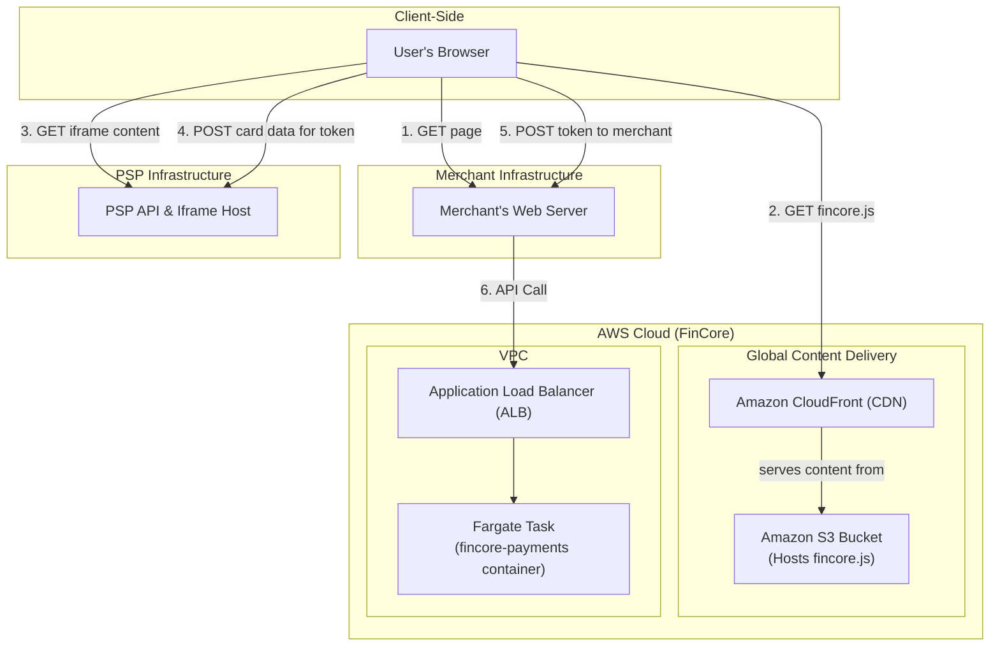

### **Architect the Secure Client-Side Tokenization Flow**

*   **Problem:** To meet our primary security goal of PCI compliance, our `fincore-payments` service must never store, process, or transmit raw credit card information. We need a secure architectural pattern that allows us to charge a customer's card without the sensitive data ever touching our servers.

*   **Solution:** We will implement a client-side tokenization flow. A lightweight "FinCore JS SDK" will be created and hosted by us. Merchants will embed this SDK on their checkout page. The SDK will render secure iframes provided by the PSP for card input fields. When the user submits their payment details, the SDK sends this information directly from the user's browser to the PSP, completely bypassing our backend. The PSP then returns a secure, one-time-use token to the SDK. This non-sensitive token is the only piece of information that the merchant's backend (the API Client) sends to our `Payment Service` to initiate the charge.

*   **Trade-offs:**
    *   **Integration Experience:**
        *   **Pro:** This model provides a seamless user experience, as the customer never leaves the merchant's website. It allows for significant UI customization to match the merchant's branding.
        *   **Con:** This requires more frontend integration effort from the merchant compared to a simple redirect.
    *   **Security & Compliance:**
        *   **Pro:** This is the industry-standard method for drastically reducing PCI DSS scope (to SAQ A-EP or SAQ A). It provides a very high level of security by ensuring sensitive data is isolated.
        *   **Con:** It introduces a third-party JavaScript dependency onto the merchant's page. We must ensure our SDK is delivered securely (e.g., via a CDN with Sub-resource Integrity) to mitigate supply-chain risks.

---

#### **Logical View (C4 Component Diagram)**

This diagram details the interactions between the new client-side components and the existing backend systems. The key architectural change is the direct communication between the browser and the PSP for tokenization.

---

#### **Physical View (AWS Deployment Diagram)**

The physical view is updated to include the hosting and delivery of our static JS SDK assets via a Content Delivery Network (CDN). The backend infrastructure remains the same as in the previous issue.

---

#### **Component-to-Resource Mapping Table**

| Logical Component | Physical Resource | Rationale |
| :--- | :--- | :--- |
| **FinCore JS SDK** | **Amazon S3 + Amazon CloudFront (CDN)** | **Performance & Availability:** Hosting the static SDK file on S3 and distributing it globally via CloudFront ensures low-latency, reliable delivery to users anywhere in the world. This is a standard, cost-effective, and highly scalable solution for static asset hosting. |
| **PSP's Iframe** | **External SaaS (Hosted by PSP)** | **Security & Compliance:** This resource is hosted and managed entirely by the Payment Service Provider. We have no control over it. Its purpose is to create a secure, isolated DOM environment for sensitive data entry, which is the cornerstone of our PCI compliance strategy. |
| **Payment Service** | **AWS Fargate Task** | (No change from previous issue) |
| **API Client** | **External System** | (No change from previous issue) |
| **Payment Service Provider**| **External SaaS** | (No change from previous issue) |