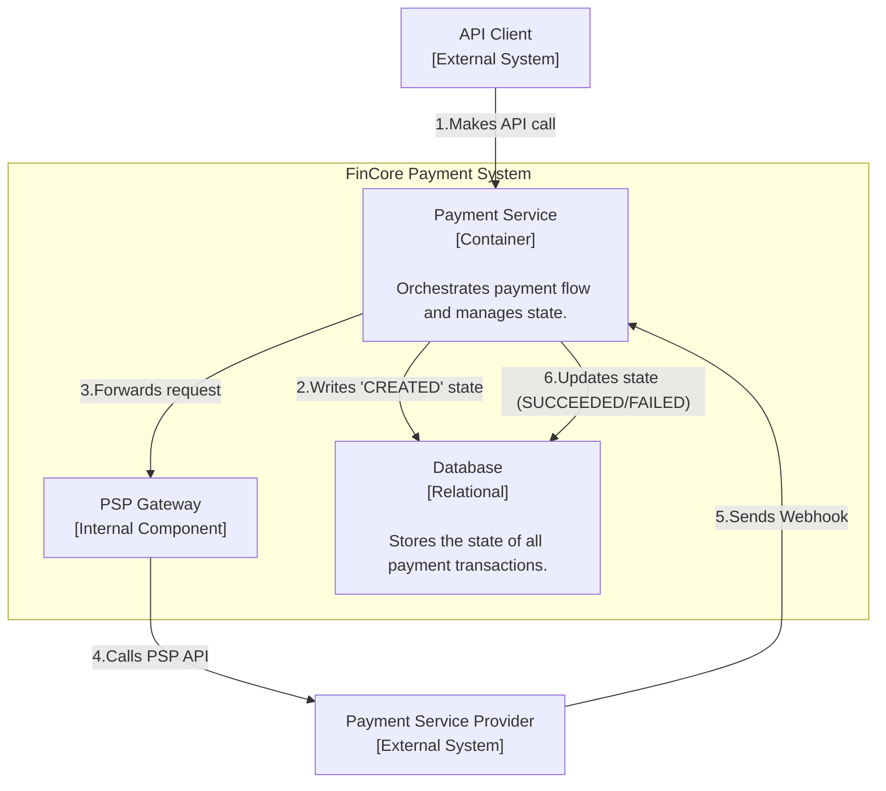
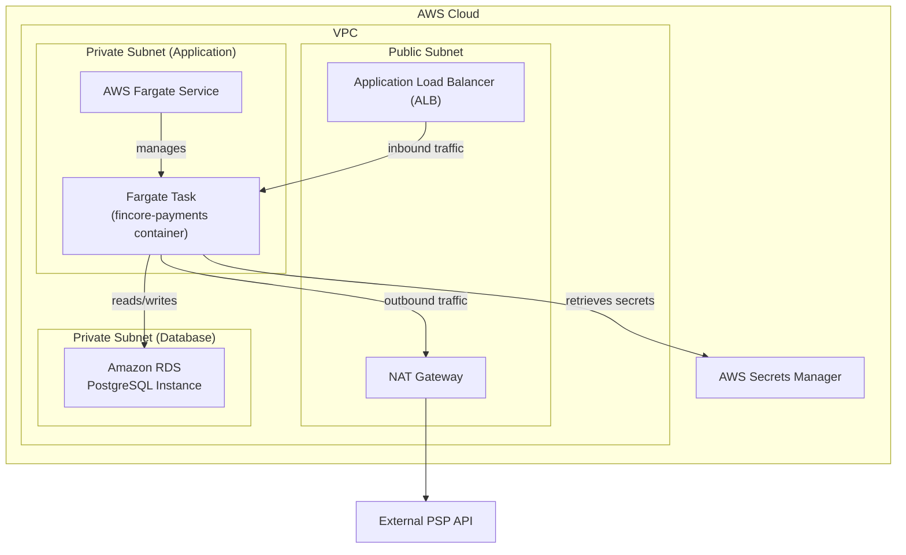

### **Architect the Foundational Data Model and State Machine**

*   **Problem:** The `Payment Service` is currently stateless. It can receive a request and forward it to a PSP, but it has no memory of the transaction. We need a persistence layer to store and track the state of each payment throughout its lifecycle, from creation to its final success or failure.

*   **Solution:** Introduce a relational database to store transaction data. A new logical `Database` component will be added to the architecture. The initial schema will consist of a `payments` table to hold the state and details of each charge. The `Payment Service` will be responsible for all interactions with this database, including creating a new record upon request and updating its status based on webhook notifications. We will use a managed PostgreSQL database to ensure data integrity and reliability.

*   **Trade-offs:**
    *   **SQL vs. NoSQL:**
        *   **Pro:** A relational database (SQL) like PostgreSQL is chosen for its strong consistency and ACID compliance guarantees. For financial transactions where data integrity is paramount, this is the safest and most standard choice.
        *   **Con:** Relational databases have a more rigid schema than NoSQL databases, making future changes more complex. However, the core attributes of a payment are stable and unlikely to require frequent, unstructured changes, making this a suitable trade-off.
    *   **Managed vs. Self-Hosted Database:**
        *   **Pro:** Using a managed service like **Amazon RDS** abstracts away the complexities of database administration, including automated backups, patching, scaling, and high availability, which is critical for a core financial service.
        *   **Con:** The cost is higher than self-hosting a database on an EC2 instance, but the significant gains in reliability and reduced operational overhead justify the expense.

---

#### **Logical View (C4 Component Diagram)**

The logical view now includes a new `Database` component. The `Payment Service` is now stateful, as it reads from and writes to this database to manage the lifecycle of a payment.

---

#### **Physical View (AWS Deployment Diagram)**

The physical diagram is updated to include an Amazon RDS instance within our VPC. Crucially, it is placed in a dedicated private subnet with no direct route to the internet for maximum security.

---

#### **Component-to-Resource Mapping Table**

| Logical Component | Physical Resource | Rationale |
| :--- | :--- | :--- |
| **Payment Service** | **AWS Fargate Task** | (No change) |
| **PSP Gateway** | **AWS Fargate Task** (module within the container) | (No change) |
| **Database** | **Amazon RDS for PostgreSQL** | **Managed & Reliable:** RDS is a managed relational database service that handles backups, patching, and failover, ensuring our critical transaction data is safe and highly available. **Security:** Placing the database in a dedicated private subnet ensures it is completely isolated from the public internet and can only be accessed by services within the VPC. **Consistency:** PostgreSQL's strong ACID compliance is essential for maintaining the integrity of financial records. |
| **(Secure Egress)** | **NAT Gateway** | (No change) |
| **(Secret Management)**| **AWS Secrets Manager** | (No change) |
