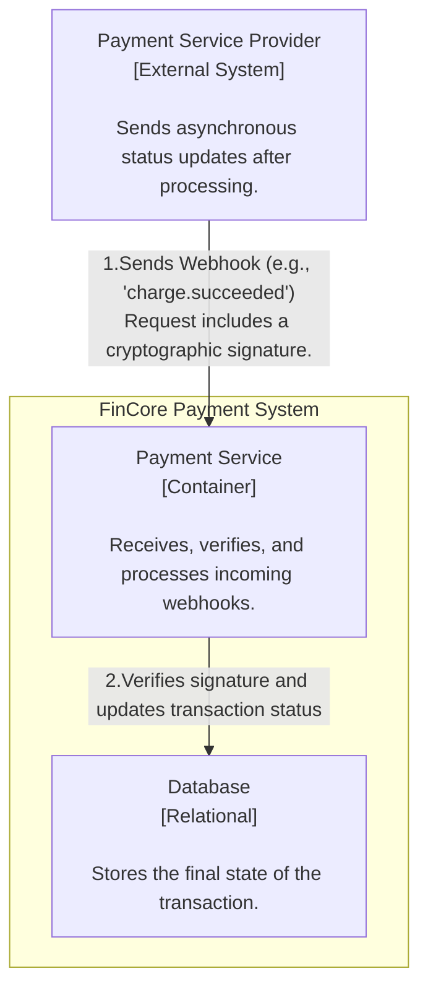
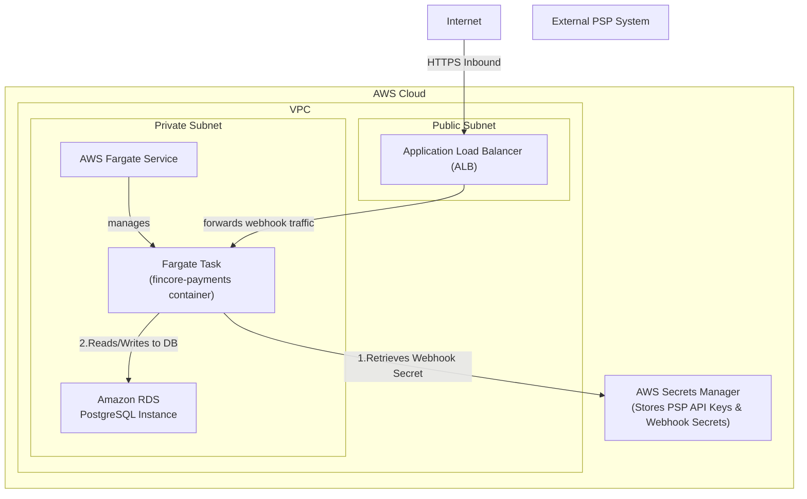

### **Architect a Secure and Reliable PSP Webhook Handler**

*   **Problem:** Payment processing is frequently asynchronous. After our service requests a charge, the final confirmation (`succeeded` or `failed`) is sent by the PSP at a later time. Our system needs a secure and reliable way to receive these external, asynchronous updates to finalize the transaction's state in our database. Without this, payments would be perpetually stuck in the `PROCESSING` state.

*   **Solution:** We will create a dedicated, public API endpoint (e.g., `POST /v1/webhooks/stripe`) to receive notifications from the PSP. This handler must be robust and perform two critical functions in order:
    1.  **Signature Verification (Security):** The handler's first step must be to cryptographically verify the signature of every incoming webhook request. This is done using a shared secret key (provided by the PSP and stored securely by us) to ensure the request is authentic and originates from the correct PSP, preventing spoofing attacks.
    2.  **State Transition (Logic):** After successful verification, the handler will parse the event payload, look up the corresponding transaction in the `Database` using the `psp_charge_id`, and update its status to the final state (`SUCCEEDED` or `FAILED`).

*   **Trade-offs:**
    *   **Webhook Processing (Synchronous vs. Asynchronous):**
        *   **Pro:** For the MVP, the handler will process the webhook synchronously (verify, update DB, and return `200 OK`). This is simpler to implement and sufficient for initial traffic volumes.
        *   **Con:** If the processing logic becomes slow, it could cause timeouts for the PSP, leading them to retry the webhook and creating unnecessary load. We accept this trade-off for now and will introduce a queue for asynchronous processing in a later phase if needed.
    *   **Security of Webhook Secret:**
        *   **Pro:** Storing the webhook signing secret in **AWS Secrets Manager** is the most secure method. It keeps the secret out of code and environment variables, providing audited, IAM-controlled access.
        *   **Con:** It introduces a dependency on an external service for a critical security check. This is a standard and acceptable trade-off for the security benefits gained.

---

#### **Logical View (C4 Component Diagram)**

This diagram emphasizes the webhook flow. The key interaction is initiated by the external `Payment Service Provider`, which calls back into our `Payment Service` to provide the final transaction status.

---

#### **Physical View (AWS Deployment Diagram)**

The physical infrastructure remains the same. This diagram clarifies the data flow for an incoming webhook and highlights that the Webhook Secret is also stored in AWS Secrets Manager.

---

#### **Component-to-Resource Mapping Table**

| Logical Component | Physical Resource | Rationale |
| :--- | :--- | :--- |
| **Payment Service** | **AWS Fargate Task** | (No change) The container's application logic now includes the webhook handling endpoint and signature verification logic. |
| **Database** | **Amazon RDS for PostgreSQL** | (No change) Stores the final, updated state of the payment. |
| **(Webhook Secret)** | **AWS Secrets Manager** | **Security:** The webhook signing secret is as sensitive as an API key. Storing it in Secrets Manager ensures it is managed securely and accessed only by the Fargate task via its IAM role. |
