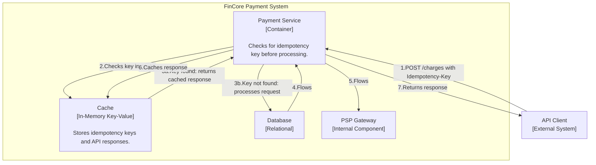
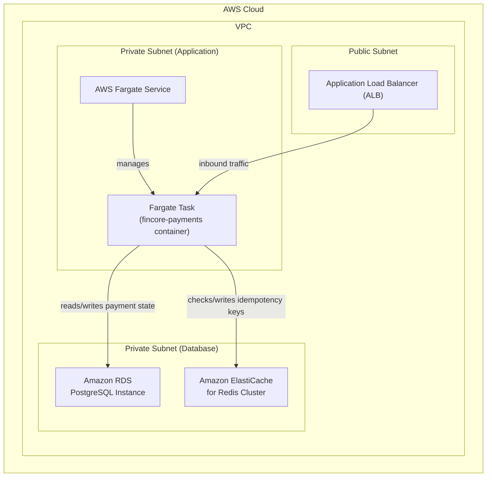

### **Architect the API Idempotency Layer for Safe Retries**

*   **Problem:** API clients, such as a merchant's backend, will inevitably retry requests due to network timeouts or other transient failures. For `POST` requests that create a charge, a simple retry could lead to the same payment being processed multiple times, resulting in a critical error (a double charge). The system currently lacks a mechanism to safely handle these retries.

*   **Solution:** We will implement an idempotency layer for all state-changing endpoints (`POST /v1/charges`, `POST /v1/refunds`). API clients will be required to provide a unique `Idempotency-Key` in the request header. The `Payment Service` will first check if this key has been seen before by querying a fast, in-memory cache.
    *   If the key exists, the service will return the previously generated response without re-processing the request.
    *   If the key does not exist, the service will process the request normally and, just before returning the response, it will save the response against the idempotency key in the cache with a 24-hour Time-to-Live (TTL).
    This ensures "exactly-once" processing from the perspective of the API client.

*   **Trade-offs:**
    *   **Choice of Cache Store (Redis vs. Database):**
        *   **Pro:** Using a dedicated in-memory cache like **Amazon ElastiCache for Redis** offers extremely low-latency read/write operations. This is crucial for minimizing the performance impact on the request-response cycle. Redis's native support for TTLs makes it perfect for managing the 24-hour lifespan of idempotency keys.
        *   **Con:** It introduces a new piece of infrastructure to manage. However, using a managed service like ElastiCache significantly mitigates this operational burden. The risk of data loss in a cache failure is acceptable for idempotency keys, as the worst-case scenario is a failed request, not a duplicate charge.
    *   **Scope of Idempotency:** We will only implement this for `POST` requests as `GET` requests are naturally idempotent. This focuses our efforts on preventing the most critical type of error.

---

#### **Logical View (C4 Component Diagram)**

The logical view is updated to include a `Cache` component. The `Payment Service` now uses this cache as the first step in processing any write request to ensure idempotency.

---

#### **Physical View (AWS Deployment Diagram)**

The physical diagram now includes an **Amazon ElastiCache for Redis** cluster. This cluster is placed in the private database subnet for security, allowing access only from the Fargate task.

---

#### **Component-to-Resource Mapping Table**

| Logical Component | Physical Resource | Rationale |
| :--- | :--- | :--- |
| **Payment Service** | **AWS Fargate Task** | (No change) |
| **PSP Gateway** | **AWS Fargate Task** (module within the container) | (No change) |
| **Database** | **Amazon RDS for PostgreSQL** | (No change) |
| **Cache** | **Amazon ElastiCache for Redis** | **Performance & Suitability:** Redis is an in-memory data store providing sub-millisecond latency, which is ideal for a high-throughput check that occurs on every write operation. **Managed Service:** ElastiCache handles the setup, patching, and management of the Redis cluster, reducing operational load. **Security:** Placing the cluster in a private subnet ensures it is only accessible from within our VPC. |
