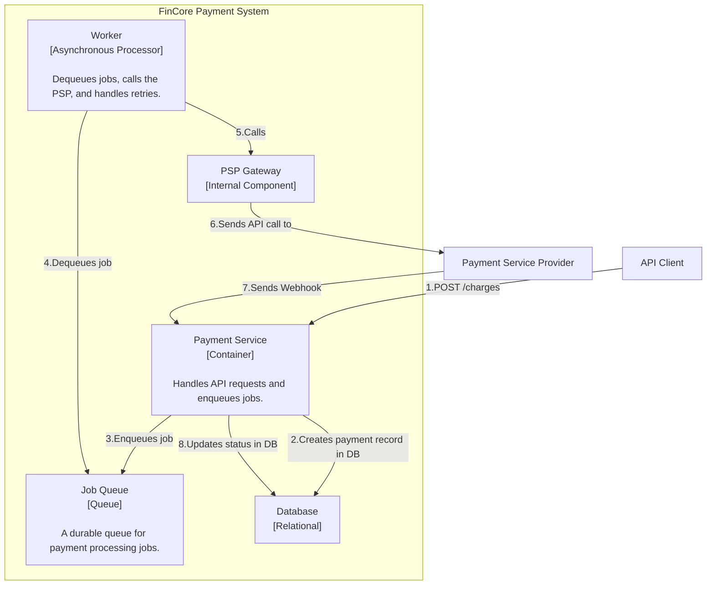
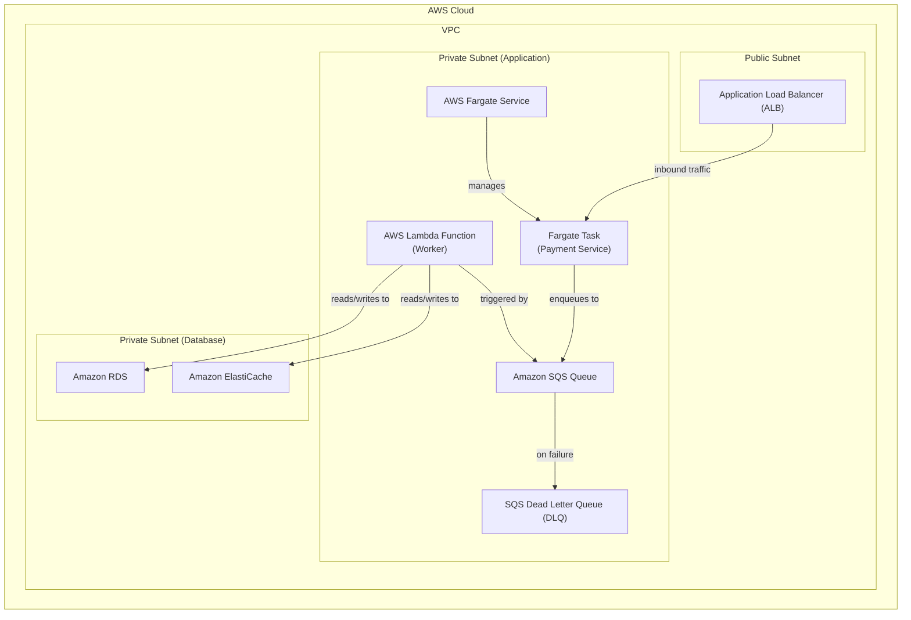

### **Architect a Resilient Asynchronous Processing and Retry Mechanism**

*   **Problem:** The current architecture processes payment requests synchronously within the API call. If the external PSP is slow or unavailable, our API response time will degrade significantly, leading to a poor client experience and potential timeouts. A network failure during this synchronous call could also leave the payment in an orphaned state without a clear path to recovery.

*   **Solution:** We will decouple the payment processing from the synchronous API flow by introducing a **Job Queue** pattern.
    1.  When a request is made to `POST /v1/charges`, the `Payment Service` will now perform only two actions: create the initial payment record in the database with a `CREATED` status and enqueue a "Process Payment" job. It will then immediately return a `202 Accepted` response.
    2.  A new, independent **Worker** component will be responsible for consuming jobs from this queue.
    3.  This Worker will implement the robust retry logic (with exponential backoff and jitter) for calling the PSP. If a job fails permanently after all retries, it will be moved to a **Dead Letter Queue (DLQ)**, which will trigger an alert for manual intervention.

*   **Trade-offs:**
    *   **Asynchronous Complexity:**
        *   **Pro:** This architecture is significantly more resilient and reliable. It makes the API fast and responsive, and ensures that transient PSP outages do not cause dropped requests. The DLQ acts as a crucial safety net.
        *   **Con:** It introduces asynchronous complexity, which can be more challenging to debug and test end-to-end compared to a simple synchronous flow. This is a necessary trade-off for a production-grade system.
    *   **Choice of Queue & Worker Technology:**
        *   **Pro:** Using **Amazon SQS** for the queue and **AWS Lambda** for the worker is a powerful serverless combination. SQS is highly durable and has a native DLQ feature. Lambda is a cost-effective, auto-scaling compute service that is perfectly suited for processing events from a queue. This combination minimizes operational overhead.
        *   **Con:** For extremely high-throughput or complex routing scenarios, other brokers like Kafka might be considered, but SQS provides the best balance of simplicity and reliability for this use case.

---

#### **Logical View (C4 Component Diagram)**

The logical view is refactored to show the decoupling. The `Payment Service` no longer calls the `PSP Gateway` directly. Instead, it places jobs on a `Job Queue`, which are then processed by a new `Worker` component.

---

#### **Physical View (AWS Deployment Diagram)**

The physical diagram is updated to include Amazon SQS for the queue and an AWS Lambda function as the worker. The Lambda function is placed in the private application subnet to securely access other resources.

---

#### **Component-to-Resource Mapping Table**

| Logical Component | Physical Resource | Rationale |
| :--- | :--- | :--- |
| **Payment Service** | **AWS Fargate Task** | (Role refined) Now responsible for handling synchronous API requests, validation, and enqueuing jobs. Its processing load is reduced, making it more responsive. |
| **Job Queue** | **Amazon SQS (Simple Queue Service)** | **Serverless & Durable:** SQS is a fully managed service that guarantees message delivery. Its native integration with a Dead Letter Queue (DLQ) simplifies the implementation of our failure handling strategy. |
| **Worker** | **AWS Lambda Function** | **Event-Driven & Scalable:** Lambda is a serverless compute service that automatically scales based on the number of messages in the SQS queue. It's a cost-effective and operationally simple way to run the asynchronous processing logic. |
| **Database** | **Amazon RDS for PostgreSQL** | (No change) |
| **Cache** | **Amazon ElastiCache for Redis**| (No change) |
