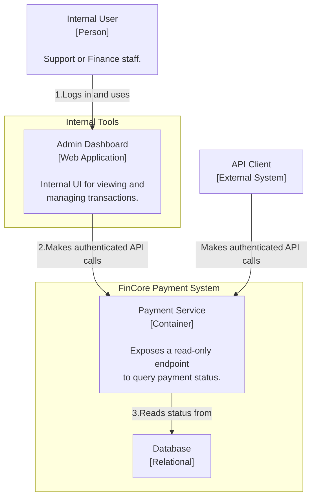
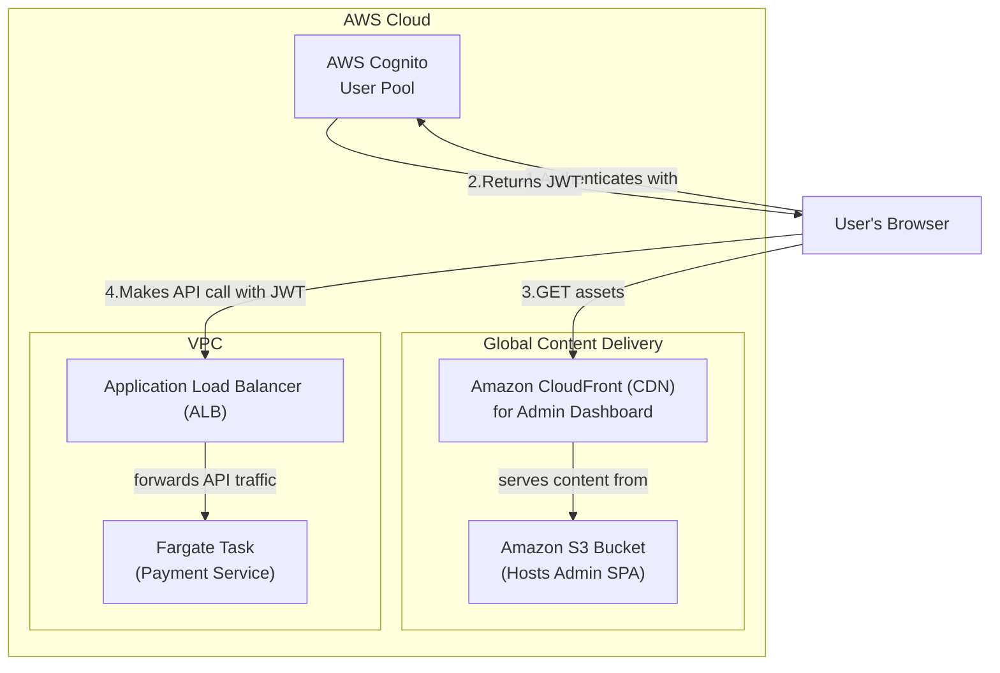

### **Architect the Payment Query API and an Internal Dashboard**

*   **Problem:** Merchants and internal support staff currently have no self-service way to view the status of transactions. They cannot programmatically query a specific payment, and there is no central place to see an overview of payment activity. This lack of visibility is a major operational deficiency, leading to increased support load and an inability to troubleshoot issues effectively.

*   **Solution:** We will introduce two components to solve this:
    1.  **A Public Query API:** Implement the `GET /v1/charges/{charge_id}` endpoint. This will allow merchants to programmatically retrieve the full state of a payment object, including its current status, amount, and related metadata.
    2.  **An Internal Admin Dashboard:** Create a simple, secure, internal-facing web application. This dashboard will provide a user interface for authorized internal staff (e.g., support, finance) to search for and view transactions. It will be a separate frontend application that authenticates users and interacts with the new query API.

*   **Trade-offs:**
    *   **Separate Admin App vs. Integrated:** The Admin Dashboard will be a separate Single Page Application (SPA).
        *   **Pro:** This decouples the internal tool from the core, mission-critical payment service. The dashboard can be developed, deployed, and iterated on independently without any risk to payment processing. It also prevents any potential security vulnerabilities in the dashboard from affecting the core API.
        *   **Con:** It requires managing a separate (though small) project and deployment pipeline. This is a standard and worthwhile trade-off for the improved security and operational independence.
    *   **Authentication for Internal Dashboard:** We will use a managed identity provider.
        *   **Pro:** Using **AWS Cognito** is the fastest and most secure way to implement user authentication and authorization for the dashboard. It handles user management, login UI, and secure token issuance (JWTs), saving significant development effort and reducing security risks compared to a custom solution.
        *   **Con:** It adds a dependency on another AWS service. This is an acceptable trade-off for a feature that is not on the core payment processing path but has critical security requirements.

---

#### **Logical View (C4 Component Diagram)**

The logical view now shows a new actor, the `Internal User`, and a new `Admin Dashboard` component. It also illustrates the new read-only query interaction from both the dashboard and the external `API Client`.

---

#### **Physical View (AWS Deployment Diagram)**

The physical view is updated to include the new components for the Admin Dashboard. A new S3/CloudFront stack is added for hosting the frontend, and AWS Cognito is added for user authentication.

---

#### **Component-to-Resource Mapping Table**

| Logical Component | Physical Resource | Rationale |
| :--- | :--- | :--- |
| **Payment Service** | **AWS Fargate Task** | (Role refined) Now also handles authenticated `GET` requests for querying payment status. |
| **Admin Dashboard** | **Amazon S3 + Amazon CloudFront** | **Serverless & Scalable:** This is the standard, cost-effective, and secure way to host a Single Page Application (SPA). CloudFront provides global low-latency access and can be configured to serve the private S3 content. |
| **(Dashboard Auth)** | **AWS Cognito** | **Managed & Secure:** Cognito provides a complete, managed authentication and user management solution. It integrates seamlessly with ALBs and API Gateways to validate JWTs, securing our internal API endpoints from unauthorized access. |
| **Internal User** | **Person** | This represents the human operator interacting with the system. |
| **API Client** | **External System** | (No change) |
| **Database** | **Amazon RDS for PostgreSQL**| (No change) |
