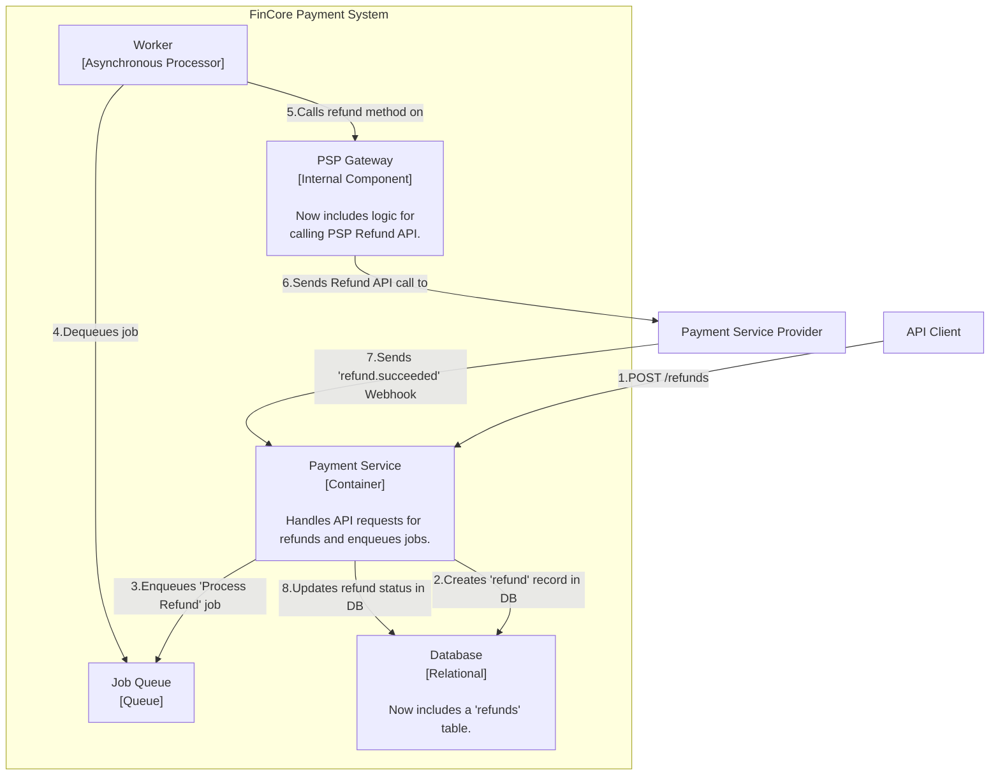
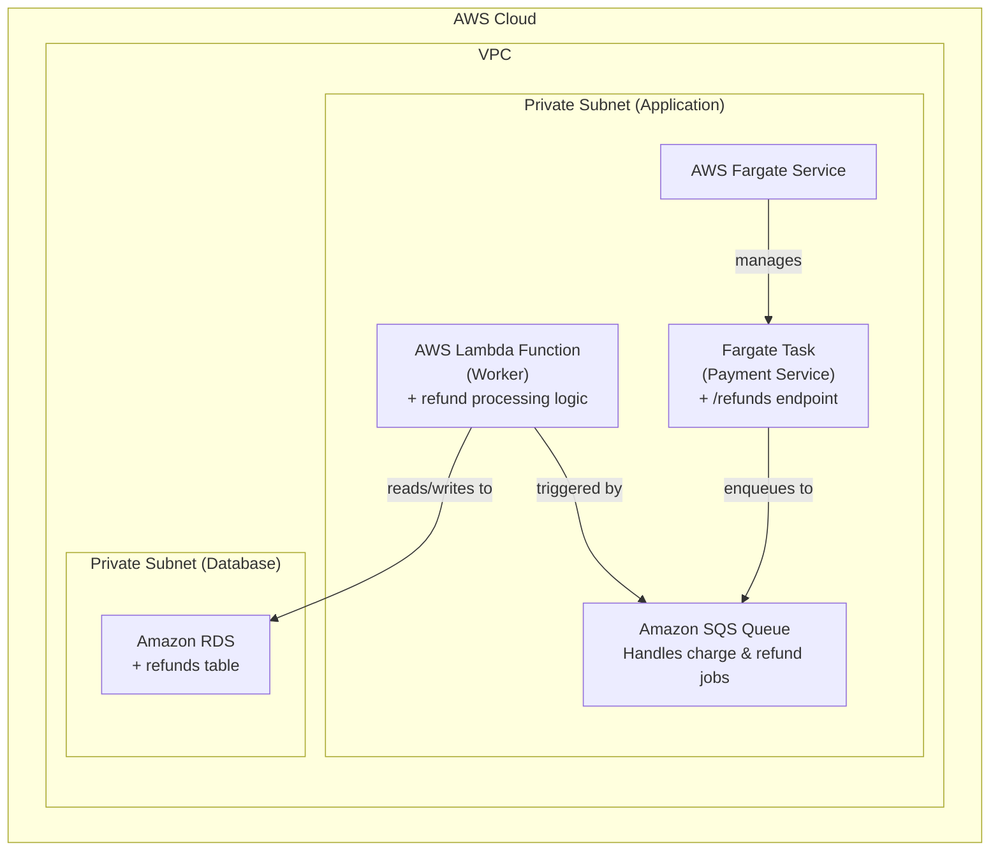

### **Architect Refunding Capabilities**

*   **Problem:** A core requirement for any payment system is the ability to issue refunds. Merchants need a way to return funds to a customer for a previously successful charge, either in full or partially. This process must be as reliable and auditable as the original payment.

*   **Solution:** We will introduce a refund flow that mirrors the asynchronous architecture of our payment flow. A new API endpoint, `POST /v1/refunds`, will be created. This endpoint will accept a `charge_id` and an optional `amount`. A new `refunds` table will be added to the database to track the state of each refund attempt. The refund process will leverage the existing job queue and worker infrastructure. The `PSP Gateway` will be extended to communicate with the PSP's refund API. This entire flow will be idempotent to prevent duplicate refunds.

*   **Trade-offs:**
    *   **Data Model (Separate Table):**
        *   **Pro:** Creating a dedicated `refunds` table is the correct accounting practice. It treats refunds as first-class, immutable events linked to a charge, rather than simply modifying the original charge. This provides a clear, auditable trail of all money movement.
        *   **Con:** Retrieving a charge with all its refunds requires a database `JOIN`, which is a standard and acceptable trade-off for data integrity.
    *   **Infrastructure Reuse:**
        *   **Pro:** Reusing the existing SQS queue and Lambda worker is highly efficient. It extends our reliable processing pattern to refunds without adding new infrastructure, reducing operational costs and complexity.
        *   **Con:** The job messages in the queue will now need an attribute (e.g., `type: 'REFUND'`) to distinguish them from charges. This requires the worker to have simple routing logic, which is a minor and manageable complexity.

---

#### **Logical View (C4 Component Diagram)**

The logical view is updated to show the new refund flow, which runs parallel to the existing charge flow, utilizing the same core components.

---

#### **Physical View (AWS Deployment Diagram)**

No new physical resources are required. This diagram illustrates how the existing infrastructure handles the new refund workflow. The primary changes are in the application logic within the Fargate task and the Lambda worker, and the addition of a new table in the existing RDS database.

---

#### **Component-to-Resource Mapping Table**

| Logical Component | Physical Resource | Rationale |
| :--- | :--- | :--- |
| **Payment Service** | **AWS Fargate Task** | **Role Expanded:** The logic is updated to include the `POST /v1/refunds` endpoint, request validation, and the creation and enqueuing of refund jobs. |
| **Worker** | **AWS Lambda Function** | **Role Expanded:** The worker logic is updated to handle messages of type `REFUND`, directing them to the `PSP Gateway`'s refund functionality. The existing retry and DLQ mechanisms are reused. |
| **Database** | **Amazon RDS for PostgreSQL** | **Schema Expanded:** A new `refunds` table is added, with a foreign key linking back to the `payments` table. This maintains relational integrity. |
| **Job Queue** | **Amazon SQS** | (No change in resource) **Payload Updated:** The message format is updated to include a `job_type` field to differentiate between charge and refund jobs. |
| **PSP Gateway** | **AWS Fargate Task** (module within the container) | **Logic Expanded:** The internal gateway module is updated with a new method to handle the specifics of the PSP's refund API. |
