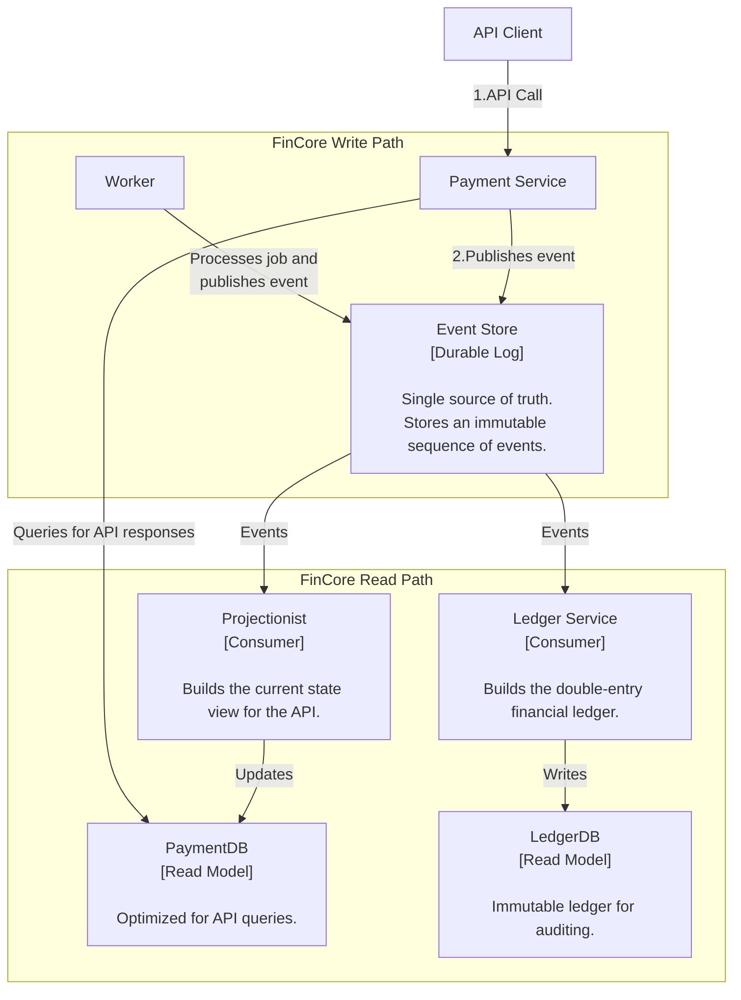
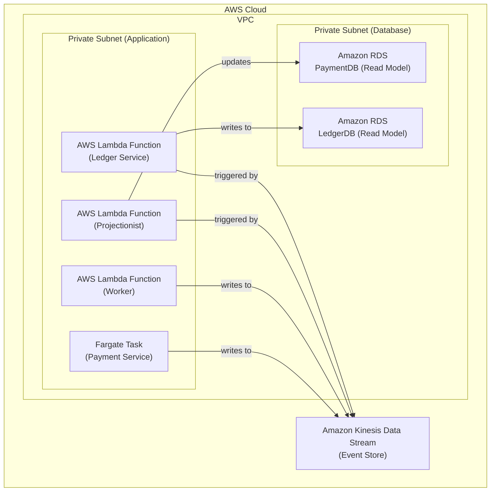

### **Architect the System around an Event-Sourced Ledger**

*   **Problem:** The current architecture directly modifies data in the `payments` and `refunds` tables. This "state-oriented" approach, while functional, does not provide a true, immutable audit log. For a financial system, knowing the *current state* is not enough; we must have an unchangeable record of every single event that led to that state. Reconstructing history or debugging complex transaction issues is difficult and error-prone with the current model.

*   **Solution:** We will refactor the core of the system to an **Event Sourcing** pattern. This will become the system's single source of truth.
    1.  **Introduce an Event Store:** This will be the primary write destination. All state changes (e.g., `ChargeInitiated`, `ChargeSucceeded`, `RefundProcessed`) will be published as immutable events to this store.
    2.  **Decouple Writes:** The `Payment Service` and `Worker` will no longer write directly to the PostgreSQL database. Their sole write responsibility will be to publish events to the Event Store.
    3.  **Create Read Models (Projections):** The existing PostgreSQL database will be repurposed as a "Read Model" or "Materialized View". We will create new consumer services (**Projectionists**) that listen to the Event Store and build up the current state in the database, optimized for fast API queries.
    4.  **Introduce a Ledger Service:** A dedicated `Ledger Service` will also consume from the Event Store. Its specific job is to translate business events into immutable, double-entry bookkeeping records in a dedicated `Ledger` database, ensuring financial correctness and auditability.

*   **Trade-offs:**
    *   **Architectural Complexity & Eventual Consistency:**
        *   **Pro:** This pattern provides a complete, auditable history of every transaction, which is the gold standard for financial systems. It dramatically improves debuggability, opens up powerful analytics capabilities, and decouples different data views (e.g., payment status vs. financial ledger).
        *   **Con:** This is a major architectural shift that introduces the complexity of **eventual consistency**. There will now be a small (millisecond-scale) delay between an event being published and the read models being updated. This is a standard and acceptable trade-off for the immense gains in auditability and system resilience.
    *   **Technology Choice for Event Store:**
        *   **Pro:** Using a managed streaming service like **Amazon Kinesis Data Streams** is ideal. It is designed for high-throughput, ordered, and durable event logging and integrates seamlessly with serverless components like Lambda.
        *   **Con:** It is a new and complex piece of infrastructure to manage. Using a fully managed service is critical to minimize this operational burden.

---

#### **Logical View (C4 Component Diagram)**

This diagram shows a significant architectural refactoring. The `Payment Service` and `Worker` now write to a central `Event Store`, and new consumer services build the read-side databases.

---

#### **Physical View (AWS Deployment Diagram)**

The physical view introduces Amazon Kinesis as the Event Store and additional AWS Lambda functions to act as the consumers (Projectionist and Ledger Service).

---

#### **Component-to-Resource Mapping Table**

| Logical Component | Physical Resource | Rationale |
| :--- | :--- | :--- |
| **Payment Service** | **AWS Fargate Task** | **Role Refined:** Now acts as the Command handler. Its primary write action is to publish an event to Kinesis. It reads from the `PaymentDB` to serve API queries. |
| **Worker** | **AWS Lambda Function** | **Role Refined:** Also a Command handler. Processes jobs and publishes the outcome as an event to Kinesis. |
| **Event Store** | **Amazon Kinesis Data Streams** | **Managed & Scalable:** Kinesis is a fully managed, real-time data streaming service. It guarantees the ordering and durability of events, making it a perfect choice for an event store. It integrates natively with Lambda for a serverless consumer architecture. |
| **Projectionist** | **AWS Lambda Function** | **Event-Driven:** A dedicated Lambda function is the ideal, cost-effective way to implement a consumer. It is triggered by new events in Kinesis and is responsible for updating the `PaymentDB` read model. |
| **Ledger Service** | **AWS Lambda Function** | **Event-Driven & Isolated:** A separate Lambda function ensures the critical logic for building the financial ledger is isolated from the logic for building the API's read model. |
| **PaymentDB** | **Amazon RDS for PostgreSQL** | **Role Refined:** This is now a **Read Model**. It is a denormalized projection of the event stream, optimized for fast queries from the `Payment Service` API. It is disposable and can be rebuilt from the Event Store if necessary. |
| **LedgerDB** | **Amazon RDS for PostgreSQL** | **Integrity & Auditability:** A separate, dedicated database for the financial ledger ensures its data model is optimized for accounting and auditing, and its security can be managed independently. |
