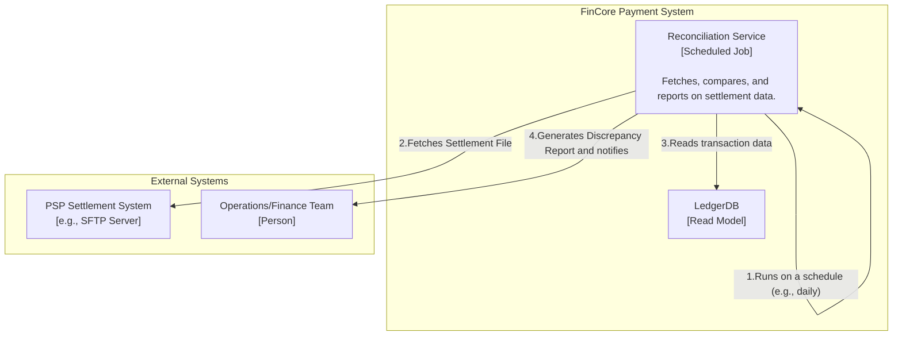
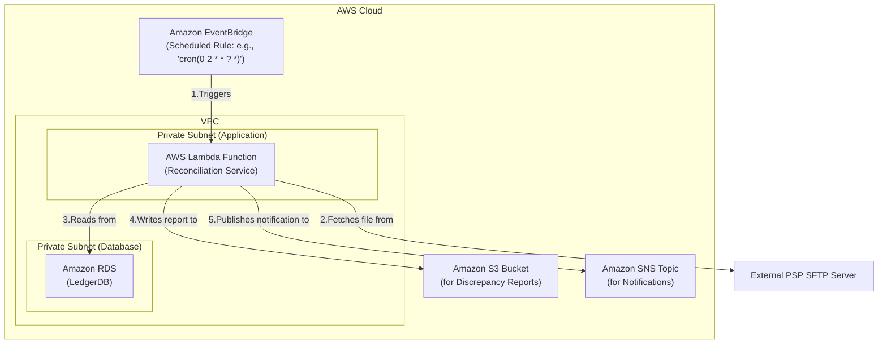

### **Architect the Automated Reconciliation Service**

*   **Problem:** Our system's ledger, while internally consistent, is not guaranteed to be a perfect match with the Payment Service Provider's records. Issues like missed webhooks, network partitions, or timing differences can lead to discrepancies. Manually comparing these records is not scalable and is a significant operational burden for the finance team.

*   **Solution:** We will create an automated, scheduled `Reconciliation Service`. This service will run on a periodic basis (e.g., daily at 02:00 UTC). Its responsibilities will be:
    1.  Securely connect to an external source (e.g., a PSP's SFTP server) to download the daily settlement report.
    2.  Parse this report (which could be in formats like CSV or XML).
    3.  Query our `LedgerDB` for all transactions within the same settlement period.
    4.  Perform a comparison to identify discrepancies (e.g., amount mismatches, or transactions present in one system but not the other).
    5.  Generate a structured `Discrepancy Report`, store it, and send a notification to an operations/finance team for review.

*   **Trade-offs:**
    *   **Implementation as a Scheduled Job:**
        *   **Pro:** A scheduled, serverless approach using **Amazon EventBridge** to trigger an **AWS Lambda function** is highly cost-effective and operationally simple. We only pay for the brief time the reconciliation job is running, and there is no need to manage servers or containers for this periodic task.
        *   **Con:** AWS Lambda has a maximum execution timeout (15 minutes). If settlement files become extremely large and take longer than this to process, we would need to migrate the logic to a long-running service like AWS Fargate or AWS Batch. The Lambda-first approach is the best starting point.
    *   **Report Storage:**
        *   **Pro:** Storing the generated discrepancy reports in **Amazon S3** is a durable, secure, and cost-effective solution. It provides a historical archive of all reconciliation activities.
        *   **Con:** Requires setting up appropriate lifecycle policies to manage storage costs over time.

---

#### **Logical View (C4 Component Diagram)**

The logical view introduces a new `Reconciliation Service`, which acts as a scheduled job. It interacts with both our internal `LedgerDB` and an external PSP system to perform its function.

---

#### **Physical View (AWS Deployment Diagram)**

The physical diagram adds the new serverless components required for reconciliation. An EventBridge rule triggers the Lambda function, which then accesses the necessary resources.

---

#### **Component-to-Resource Mapping Table**

| Logical Component | Physical Resource | Rationale |
| :--- | :--- | :--- |
| **Reconciliation Service** | **AWS Lambda Function** | **Serverless & Event-Driven:** Lambda is the ideal choice for a periodic, scheduled task. It's fully managed, cost-effective, and can be granted specific IAM permissions to securely access other AWS resources. |
| **(Scheduler)** | **Amazon EventBridge Rule** | **Managed & Reliable:** EventBridge provides a simple and highly reliable cron-like scheduler to trigger the Lambda function automatically without any custom code. |
| **(Report Storage)** | **Amazon S3 Bucket** | **Durable & Secure:** S3 is the standard for durable, cost-effective object storage. It is the perfect place to store generated reports for auditing and historical analysis. |
| **(Notification)** | **Amazon SNS Topic** | **Decoupled & Scalable:** SNS provides a publish/subscribe pattern for sending notifications. The finance team can subscribe via email, or we can later add other subscribers (like a Slack integration) without changing the core service. |
| **LedgerDB** | **Amazon RDS for PostgreSQL** | (No change) The reconciliation service will have read-only access to this database. |
| **PSP Settlement System**| **External SFTP Server** | This is a common method for secure, automated file exchange in the financial industry. |
