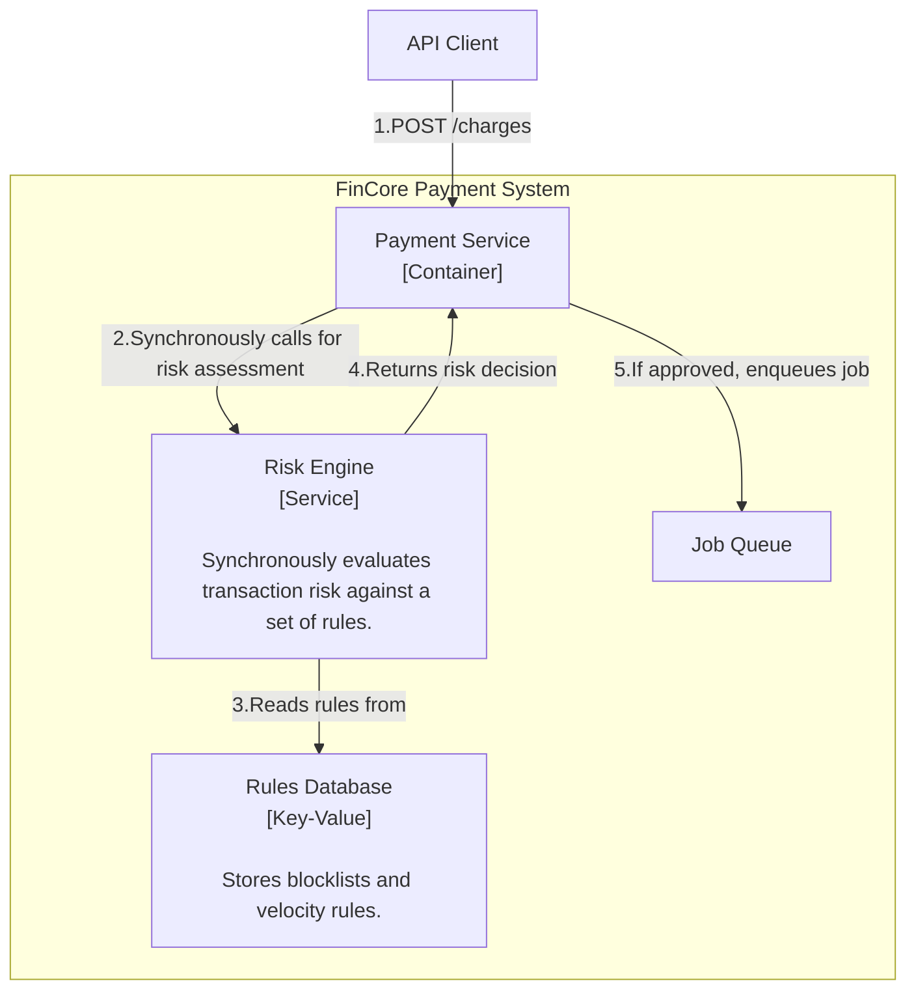
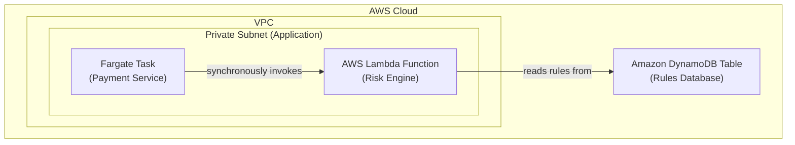

### **Architect a Rule-Based Risk Engine for Fraud Detection**

*   **Problem:** The payment system currently processes all transactions without any prior risk assessment. This exposes the platform and its merchants to significant financial risk from fraudulent activities, such as the use of stolen credit cards. We need a foundational mechanism to block obviously fraudulent transactions before they are sent to the PSP.

*   **Solution:** We will introduce a new, dedicated `Risk Engine` service. This service will be called **synchronously** by the `Payment Service` as a mandatory step in the payment initiation flow.
    1.  Upon receiving a `/charges` request, the `Payment Service` will first call the `Risk Engine` with the transaction details (e.g., amount, currency, IP address, email).
    2.  The `Risk Engine` will evaluate the transaction against a configurable set of rules (e.g., velocity checks, IP/email/BIN blocklists).
    3.  If the risk score is acceptable, the `Risk Engine` returns a success response, and the `Payment Service` proceeds to enqueue the payment job.
    4.  If the risk score is too high, the `Risk Engine` returns a failure response. The `Payment Service` will immediately stop the process, mark the payment as `FAILED` with a reason of `fraud_risk`, and return an error to the client.

*   **Trade-offs:**
    *   **Synchronous vs. Asynchronous Risk Check:** The check is synchronous and blocking.
        *   **Pro:** This is the safest approach. It allows us to immediately block a high-risk transaction *before* it is ever sent to the PSP, preventing potential chargebacks and fees.
        *   **Con:** This adds latency to the API response time. Therefore, the `Risk Engine` must be designed for p99 latency of under 50ms. This is a critical performance requirement.
    *   **Separate Service vs. Integrated Module:** The `Risk Engine` will be a separate microservice.
        *   **Pro:** Decoupling risk logic from payment orchestration is a strong architectural principle. It allows the `Risk Engine` to be developed, scaled, and maintained independently by a specialized team without affecting the core payment flow.
        *   **Con:** This introduces network overhead and the complexity of managing an additional service. This is an acceptable trade-off for isolating such a critical and distinct domain.
    *   **Rule Storage:** The initial rules will be stored in a low-latency database.
        *   **Pro:** Storing rules in a database like **Amazon DynamoDB** allows for dynamic updates to the ruleset without requiring a new code deployment. This is crucial for a responsive risk management strategy.
        *   **Con:** It adds a database dependency to a latency-sensitive service. DynamoDB's single-digit millisecond latency makes it an ideal choice to mitigate this.

---

#### **Logical View (C4 Component Diagram)**

The logical view now includes the new `Risk Engine` component, which is called synchronously by the `Payment Service`.

---

#### **Physical View (AWS Deployment Diagram)**

The physical diagram adds a new AWS Lambda function for the `Risk Engine` and an Amazon DynamoDB table for storing the rules. The `Payment Service` (Fargate Task) will invoke this new Lambda function directly.

---

#### **Component-to-Resource Mapping Table**

| Logical Component | Physical Resource | Rationale |
| :--- | :--- | :--- |
| **Risk Engine** | **AWS Lambda Function** | **Low Latency & Serverless:** Lambda is an ideal choice for the `Risk Engine` due to its extremely fast startup times and low invocation latency. As a serverless component, it scales automatically with the number of incoming payment requests. |
| **Rules Database** | **Amazon DynamoDB** | **High Performance:** DynamoDB is a managed NoSQL database that provides consistent, single-digit millisecond latency, which is essential for the synchronous, low-latency requirement of the `Risk Engine`. Its key-value nature is perfect for storing and quickly retrieving rules and blocklist entries. |
| **Payment Service** | **AWS Fargate Task** | (Role refined) Now responsible for calling the `Risk Engine` before enqueuing a job and handling the risk decision. |
| **Job Queue** | **Amazon SQS** | (No change) |
