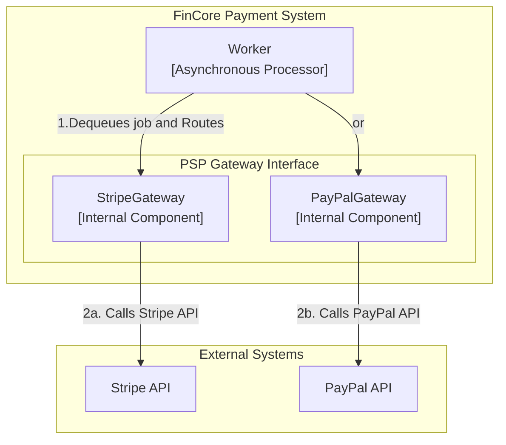
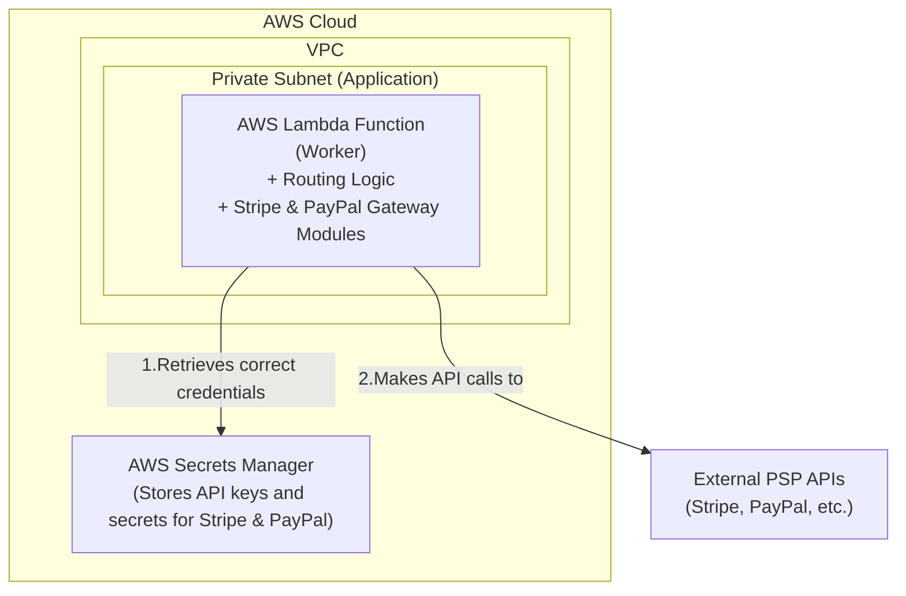

### **Architect Support for a Second Payment Service Provider**

*   **Problem:** The system currently supports only one PSP, which limits its utility and fails to deliver on the core promise of being a multi-provider payment gateway. To be a true abstraction layer, the system must be able to support multiple PSPs and route transactions to the appropriate one.

*   **Solution:** We will validate our gateway abstraction by adding a second PSP (e.g., PayPal). This involves:
    1.  **Implementing a New Gateway Module:** A new `PayPalGateway` module will be created within the `Payment Service` and `Worker`. This module will implement the same standardized interface as the existing `StripeGateway` but will contain the specific logic to communicate with PayPal's API.
    2.  **Introducing a Routing Mechanism:** The `Payment Service` will be updated to include a routing layer. When initiating a payment, it will use information from the API request (e.g., an explicit `provider` field, or derived from the `currency` or `payment_method`) to select the correct gateway implementation.
    3.  **Handling Provider-Specific Webhooks:** The webhook handler in the `Payment Service` will be updated to distinguish between incoming webhooks from different providers (e.g., by using separate endpoints like `/v1/webhooks/stripe` and `/v1/webhooks/paypal`) and applying the correct signature verification logic for each.

*   **Trade-offs:**
    *   **Unified Gateway Interface:**
        *   **Pro:** Enforcing a strict, common interface (`IGateway`) for all gateway modules is crucial. It ensures that adding a third or fourth provider in the future will not require changes to the core `Payment Service` or `Worker`, making the system highly extensible.
        *   **Con:** Designing a generic interface that accommodates the unique features of different PSPs can be challenging. Some provider-specific features might not fit neatly into the common model, requiring careful design.
    *   **Configuration Management:**
        *   **Pro:** Storing routing rules and provider configurations in a database or a configuration service allows for dynamic updates without redeploying the application.
        *   **Con:** For this initial expansion, storing the configuration within the application's deployment package (e.g., a YAML file) is simpler and sufficient. We will defer the implementation of a dynamic configuration system.

---

#### **Logical View (C4 Component Diagram)**

The logical view now shows the `PSP Gateway` as a generic interface with multiple concrete implementations. The `Worker` now includes a "Route" step to select the appropriate gateway.

---

#### **Physical View (AWS Deployment Diagram)**

The physical architecture does not change, but the components are updated to reflect their new responsibilities. The key change is that our single application container now contains the logic for multiple gateways, and AWS Secrets Manager now stores credentials for both providers.

---

#### **Component-to-Resource Mapping Table**

| Logical Component | Physical Resource | Rationale |
| :--- | :--- | :--- |
| **Worker** | **AWS Lambda Function** | **Role Expanded:** The worker's code is updated to include the routing logic that selects the appropriate PSP gateway based on the job's payload. |
| **PSP Gateway (Stripe & PayPal)** | **AWS Lambda Function** (as modules within the container) | **Efficiency:** Both gateway implementations are deployed as part of the same Lambda function package. This is efficient for now, as it avoids the need for separate deployment pipelines. As the system scales, these could be split into dedicated Lambda functions if necessary. |
| **(Secret Management)** | **AWS Secrets Manager** | **Role Expanded:** Secrets Manager is now used to store and manage the distinct sets of credentials (API keys, webhook secrets) for both Stripe and PayPal securely. |
| **Payment Service Provider** | **External SaaS** | (No change) The system now interacts with multiple external PSPs. |
