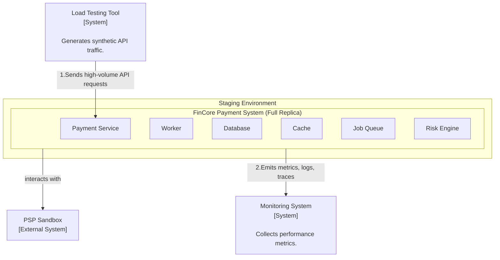
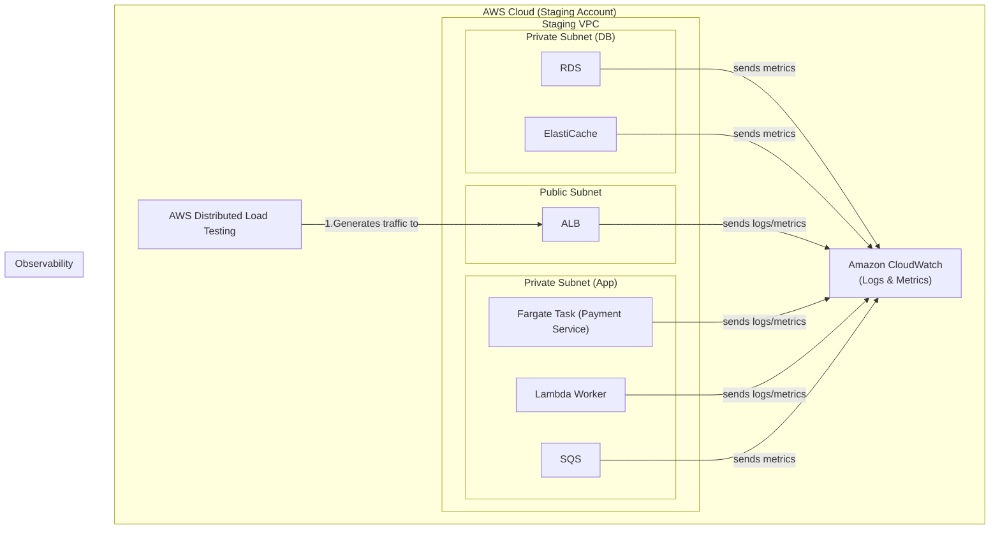

### **Architect the Performance & Load Testing Framework**

*   **Problem:** While the architecture is designed to be scalable using serverless components, its actual performance limits and potential bottlenecks under production-level traffic are unknown. We must rigorously test the system to validate that it meets the NFRs for latency and throughput before launch.

*   **Solution:** We will architect a dedicated, isolated load testing environment that is a full replica of the production setup. We will use a managed load testing service to generate high-volume, realistic traffic against this environment. Key components of this solution are:
    1.  **Staging Environment:** Provision a complete, separate `staging` environment using our Infrastructure as Code (IaC) scripts to ensure it is an exact mirror of production.
    2.  **Load Generation:** Use a managed service, **AWS Distributed Load Testing**, to simulate traffic. This allows us to generate a high number of concurrent users and define test scenarios that mimic real-world usage patterns (e.g., 80% charge creations, 20% status queries).
    3.  **Monitoring:** Utilize **Amazon CloudWatch** to collect and analyze a wide range of metrics (latency, error rates, queue lengths, CPU/memory utilization) from all components in the staging environment during the test.

*   **Trade-offs:**
    *   **Managed vs. Self-Hosted Load Testing Tool:**
        *   **Pro:** A managed service like **AWS Distributed Load Testing** is the superior choice for this use case. It handles the provisioning of the load generation fleet, aggregates results automatically, and simplifies the process of creating and running complex test scenarios, saving significant engineering time.
        *   **Con:** It can be more costly than self-hosted alternatives (like k6 on Fargate). This is a justified expense for the accuracy and operational simplicity it provides for a critical pre-production task.
    *   **Environment Isolation:**
        *   **Pro:** Creating a full, isolated replica of the production environment is non-negotiable. It is the only way to get accurate performance data without any risk of impacting live customers or production data.
        *   **Con:** This temporarily doubles the infrastructure cost. This is a standard and necessary cost of ensuring a system is production-ready.

---

#### **Logical View (C4 Component Diagram)**

This diagram shows the logical setup for the load test. A `Load Testing Tool` acts as the user, sending a high volume of requests to a complete replica of the `FinCore Payment System`, which is observed by a `Monitoring System`.

---

#### **Physical View (AWS Deployment Diagram)**

The physical view shows the `staging` environment, a full clone of our production AWS infrastructure, being targeted by the AWS Distributed Load Testing service. All resources within the staging VPC report metrics to Amazon CloudWatch for analysis.

---

#### **Component-to-Resource Mapping Table**

| Logical Component | Physical Resource | Rationale |
| :--- | :--- | :--- |
| **Load Testing Tool** | **AWS Distributed Load Testing** | **Managed & Scalable:** This managed service is chosen for its ability to easily generate massive, distributed load, which is essential for accurately simulating production traffic and identifying scaling limits. |
| **Staging Environment**| A full replica of all previously designed AWS resources. | **Fidelity:** Using a 1:1 replica of the production environment is the only way to ensure that load test results are accurate and representative of real-world performance. |
| **Monitoring System** | **Amazon CloudWatch** | **Native Integration:** CloudWatch is the native monitoring solution in AWS. It automatically collects detailed metrics, logs, and traces from all other AWS services (ALB, Fargate, Lambda, RDS, etc.), making it the simplest and most comprehensive choice for observability during the tests. |
| **PSP Sandbox** | **External SaaS** | All load tests must be run against the PSP's dedicated sandbox/testing environment to avoid generating real financial transactions. |
