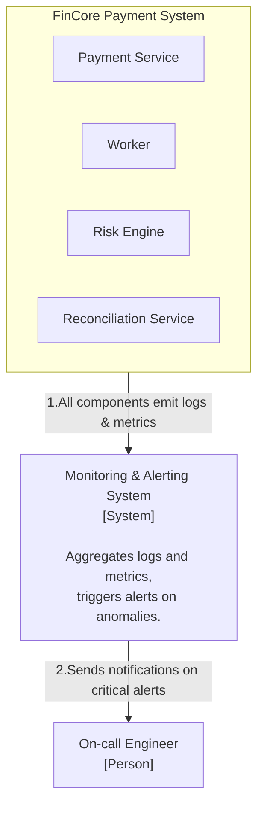
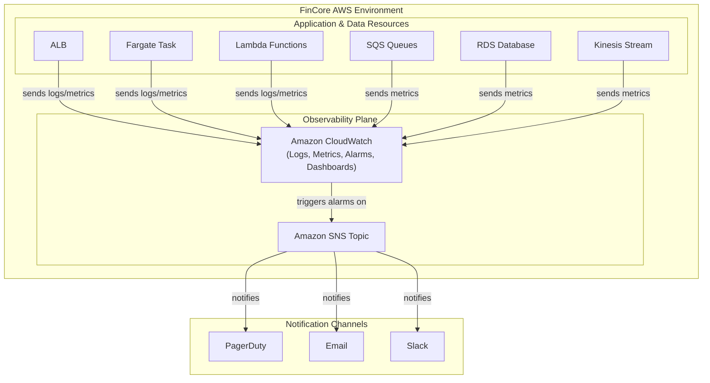

### **Architect a Comprehensive Monitoring, Alerting, and Logging Strategy**

*   **Problem:** The system can process payments, but we have limited visibility into its operational health. Without comprehensive monitoring, we cannot proactively detect issues, diagnose failures quickly, or understand performance trends. This makes the system fragile in a production environment and difficult to support.

*   **Solution:** We will implement a full observability solution based on the three pillars: metrics, logs, and traces.
    1.  **Metrics & Dashboards:** We will create a centralized operational dashboard in Amazon CloudWatch. This dashboard will display key performance indicators (KPIs) for every component, including: API latency (p95/p99), error rates (4xx/5xx), SQS queue depth and message age, Lambda invocation counts and error rates, and RDS database connection counts and CPU utilization.
    2.  **Proactive Alerting:** We will configure a set of critical CloudWatch Alarms. These alarms will trigger on predefined thresholds (e.g., "p99 API latency > 200ms for 5 minutes" or "DLQ message count > 0") and publish a notification to an SNS topic. This allows us to decouple the alarm from the notification channel (e.g., PagerDuty, email, Slack).
    3.  **Structured, Centralized Logging:** All services (Fargate and Lambdas) will be configured to output logs in a structured JSON format. Logs will include a unique `trace_id` for each transaction, allowing us to easily filter and correlate all log entries related to a single payment request. All logs will be ingested into CloudWatch Logs, enabling powerful querying via CloudWatch Logs Insights.

*   **Trade-offs:**
    *   **Observability Platform (CloudWatch vs. Third-Party):**
        *   **Pro:** Using **Amazon CloudWatch** as the primary observability platform is the most efficient choice. It natively integrates with all of our existing AWS services, minimizing setup complexity and cost. Its tools (Logs Insights, Dashboards, Alarms) are powerful enough for our needs.
        *   **Con:** Specialized third-party platforms (like Datadog, New Relic) may offer more advanced features, but at a higher cost and with greater integration effort. We are choosing the native, well-integrated solution.
    *   **Log Correlation:**
        *   **Pro:** Implementing a `trace_id` at the API entry point (ALB or Payment Service) and passing it through the entire system (SQS messages, Lambda invocations) provides immense value for debugging complex, asynchronous flows.
        *   **Con:** It requires a small amount of disciplined coding in each service to ensure the `trace_id` is correctly propagated. This is a standard practice and a worthwhile investment.

---

#### **Logical View (C4 Component Diagram)**

This diagram illustrates how all components within our system emit data to a central `Monitoring & Alerting System`, which in turn notifies the on-call team.

---

#### **Physical View (AWS Deployment Diagram)**

The physical view shows how all our existing AWS resources are configured to send their observability data to Amazon CloudWatch, which then integrates with Amazon SNS for alerting.

---

#### **Component-to-Resource Mapping Table**

| Logical Component | Physical Resource | Rationale |
| :--- | :--- | :--- |
| **Monitoring System** | **Amazon CloudWatch** | **Centralized & Native:** CloudWatch is the native AWS service for collecting logs and metrics from all other AWS resources. It provides a single pane of glass for dashboards, querying (Logs Insights), and setting alarms, making it the most efficient choice. |
| **Alerting System** | **Amazon SNS (Simple Notification Service)** | **Decoupled & Flexible:** Using an SNS topic as the target for all CloudWatch Alarms is a best practice. It decouples the alerting logic from the notification destination. We can easily add or remove subscribers (like PagerDuty, email, or Slack integrations) without having to modify the alarms themselves. |
| **On-call Engineer** | **Person** (interacting via notification channels) | The human operator who receives and responds to alerts. |
