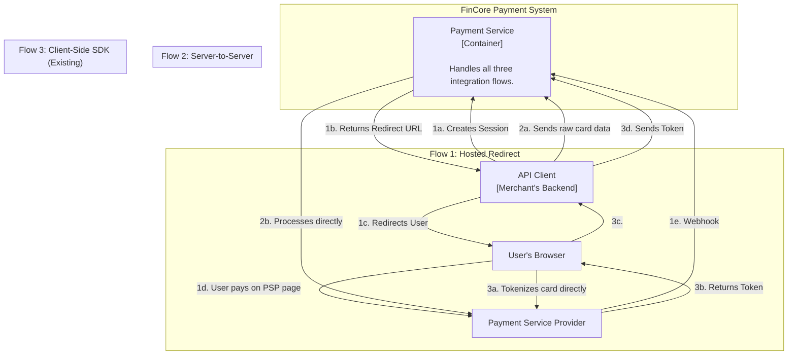
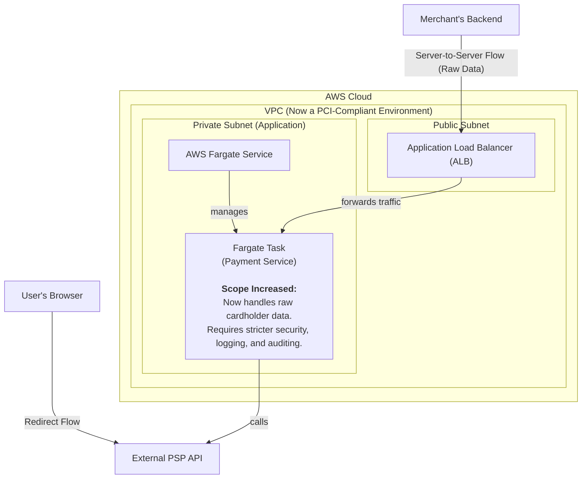
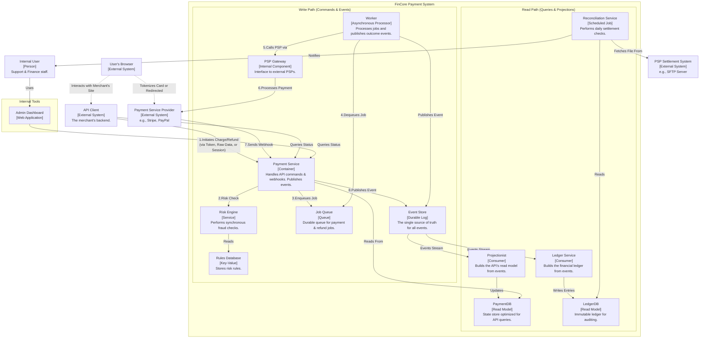

### **Architect Support for Hosted Redirect and Server-to-Server Integrations**

*   **Problem:** The current system exclusively supports a client-side SDK integration. To broaden our system's appeal and cater to merchants with different technical capabilities and compliance postures, we need to offer simpler (Hosted Redirect) and more direct (Server-to-Server) integration options.

*   **Solution:** We will enhance the `Payment Service` to support two additional, distinct payment flows:
    1.  **Hosted Redirect Flow:** A new endpoint, `POST /v1/payment_sessions`, will be created. The merchant calls this endpoint, and our service communicates with the PSP to generate a secure, one-time-use checkout URL. The merchant then redirects their customer to this URL. The PSP's hosted page handles all sensitive data collection. Upon completion, the PSP notifies our system of the outcome via the existing webhook infrastructure.
    2.  **Server-to-Server Flow:** The `POST /v1/charges` endpoint will be enhanced to accept raw cardholder data (PAN, CVC, etc.). This flow will be strictly firewalled and only accessible to merchants who are explicitly authorized and have demonstrated their own PCI compliance. The `Payment Service` will pass this data directly to the `PSP Gateway`. This significantly increases our system's PCI DSS scope.

*   **Trade-offs:**
    *   **Hosted Redirect:**
        *   **Pro:** Offers the simplest possible integration for merchants and reduces their PCI scope to the minimum (SAQ A).
        *   **Con:** The user is redirected away from the merchant's site, which can negatively impact conversion rates. We have less control over the user experience.
    *   **Server-to-Server:**
        *   **Pro:** Gives merchants who are PCI compliant complete control over their checkout experience.
        *   **Con:** This is a **major security and compliance trade-off**. By accepting raw cardholder data, our system's PCI scope expands dramatically, requiring much stricter security controls, auditing, and potentially dedicated infrastructure. This is a high-risk, high-complexity feature to implement and maintain.

---

#### **Logical View (C4 Component Diagram)**

This diagram shows the two new logical flows alongside the existing SDK flow, highlighting the different paths data takes for each integration method.

---

#### **Physical View (AWS Deployment Diagram)**

The physical architecture does not require new components but demands a significant increase in the security posture of the existing `Payment Service` to handle its expanded PCI scope. This is noted directly on the diagram.

---

#### **Component-to-Resource Mapping Table**

| Logical Component | Physical Resource | Rationale |
| :--- | :--- | :--- |
| **Payment Service** | **AWS Fargate Task** | **Role Expanded & Security Hardened:** The service logic is updated to handle all three integration flows. Critically, because it now processes raw cardholder data for the Server-to-Server flow, the entire environment (VPC, Fargate task, logging, etc.) must be brought into a stricter PCI DSS compliant scope, requiring more rigorous security controls, monitoring, and regular auditing. |
| **User's Browser** | **External User Agent** | (No change) Interacts differently depending on the chosen flow (redirected vs. using the SDK). |
| **API Client** | **External System** | (No change) Interacts differently depending on the chosen flow (sending raw data vs. a token). |
| **All other components**| (No change) | The existing databases, queues, and workers continue to function as previously designed. |

#### **Overall Logical View**

#### **Overall Physical View**

```mermaid
graph TD
    %% --- External Actors & Systems ---
    api_client["Merchant's Backend"]
    user_browser["User's Browser"]
    internal_user["Internal User"]
    psp_api["External PSP API"]
    psp_sftp["External PSP SFTP"]

    %% --- AWS Cloud Boundary ---
    subgraph aws_cloud["AWS Cloud"]
        
        %% --- Global & Non-VPC Services ---
        subgraph devops_and_delivery["DevOps & Global Delivery"]
            direction LR
            codepipeline["AWS CodePipeline"]
            cdn_sdk["CloudFront (for SDK)"]
            s3_sdk["S3 (for SDK)"]
            cdn_admin["CloudFront (for Admin UI)"]
            s3_admin["S3 (for Admin UI)"]
        end
        
        subgraph security_and_identity["Security & Identity"]
            direction LR
            cognito["AWS Cognito"]
            secrets_manager["AWS Secrets Manager"]
        end
        
        subgraph serverless_plane["Serverless Plane (Messaging & Data)"]
            direction TB
            kinesis["Amazon Kinesis<br>(Event Store)"]
            sqs["Amazon SQS<br>(Job Queue)"]
            dlq["SQS DLQ"]
            dynamodb["Amazon DynamoDB<br>(Rules DB)"]
        end

        subgraph notifications["Notifications"]
            direction LR
            eventbridge["Amazon EventBridge"]
            sns["Amazon SNS Topic"]
        end
        
        %% --- VPC Boundary ---
        subgraph vpc["VPC (PCI-Compliant Environment)"]
            subgraph public_subnet["Public Subnet"]
                alb["ALB"]
                nat["NAT Gateway"]
            end
            
            subgraph app_subnet["Private Subnet (Application)"]
                fargate_task["Fargate Task<br>(Payment Service)"]
                worker_lambda["Lambda<br>(Worker)"]
                risk_lambda["Lambda<br>(Risk Engine)"]
                projectionist_lambda["Lambda<br>(Projectionist)"]
                ledger_lambda["Lambda<br>(Ledger Service)"]
                reco_lambda["Lambda<br>(Reconciliation)"]
            end
            
            subgraph db_subnet["Private Subnet (Database)"]
                payment_db["RDS<br>(PaymentDB)"]
                ledger_db["RDS<br>(LedgerDB)"]
                redis["ElastiCache<br>(Idempotency)"]
            end
        end
    end

    %% --- Connections ---
    %% Inbound & UI
    api_client -- "API Calls" --> alb
    user_browser -- "Loads Merchant Site & SDK" --> cdn_sdk
    internal_user -- "Logs in" --> cognito
    internal_user -- "Loads Admin UI" --> cdn_admin
    cdn_sdk -- "serves" --> s3_sdk
    cdn_admin -- "serves" --> s3_admin
    alb -- "forwards to" --> fargate_task

    %% Write/Command Path
    fargate_task -- "Reads secrets" --> secrets_manager
    fargate_task -- "Invokes" --> risk_lambda
    fargate_task -- "Enqueues Job" --> sqs
    fargate_task -- "Publishes Event" --> kinesis
    risk_lambda -- "Reads rules" --> dynamodb
    worker_lambda -- "Triggered by" --> sqs
    worker_lambda -- "Reads secrets" --> secrets_manager
    worker_lambda -- "Calls out via" --> nat --> psp_api
    worker_lambda -- "Publishes Event" --> kinesis
    sqs --> dlq

    %% Read/Projection Path
    kinesis -- "Triggers" --> projectionist_lambda
    kinesis -- "Triggers" --> ledger_lambda
    projectionist_lambda -- "Writes to" --> payment_db
    ledger_lambda -- "Writes to" --> ledger_db
    fargate_task -- "Reads for queries" --> payment_db
    fargate_task -- "Reads/Writes idempotency keys" --> redis

    %% Reconciliation & Alerting
    eventbridge -- "Triggers" --> reco_lambda
    reco_lambda -- "Reads secrets" --> secrets_manager
    reco_lambda -- "Fetches file via" --> nat --> psp_sftp
    reco_lambda -- "Reads from" --> ledger_db
    reco_lambda -- "Publishes alert to" --> sns
    sns -- "Notifies" --> internal_user
```

### **Component-to-Resource Mapping Table (Overall)**

| Logical Component | Physical Resource | Rationale |
| :--- | :--- | :--- |
| **Payment Service** | **AWS Fargate Task** | Handles synchronous API requests and publishes events. Fargate provides a serverless container orchestration model. |
| **Worker** | **AWS Lambda Function** | Processes jobs asynchronously from SQS. Lambda is a cost-effective, auto-scaling, event-driven compute service. |
| **Risk Engine** | **AWS Lambda Function** | Provides low-latency, synchronous fraud checks. Lambda is ideal for fast, on-demand execution. |
| **Projectionist** | **AWS Lambda Function** | Consumes events from Kinesis to build the `PaymentDB` read model. A serverless, event-driven consumer. |
| **Ledger Service** | **AWS Lambda Function** | Consumes events from Kinesis to build the immutable `LedgerDB`. A serverless, event-driven consumer. |
| **Reconciliation Service**| **AWS Lambda Function** | Runs a daily scheduled job triggered by EventBridge. Serverless is perfect for periodic, non-constant workloads. |
| **Event Store** | **Amazon Kinesis Data Streams**| Provides a durable, ordered, and scalable log for our event-sourcing pattern. |
| **Job Queue** | **Amazon SQS** | A durable, reliable, and fully managed queueing service with native DLQ support for failure handling. |
| **Rules Database** | **Amazon DynamoDB** | A managed NoSQL database providing the single-digit millisecond latency required for the synchronous risk engine. |
| **PaymentDB (Read Model)**| **Amazon RDS for PostgreSQL** | A managed relational database providing strong consistency for our API's query model. |
| **LedgerDB (Read Model)**| **Amazon RDS for PostgreSQL** | A separate managed database providing isolation and security for the immutable financial ledger. |
| **Idempotency Cache** | **Amazon ElastiCache for Redis**| A managed in-memory cache providing the low latency needed for the high-throughput idempotency check. |
| **Admin Dashboard** | **Amazon S3 + CloudFront** | A standard, secure, and highly performant way to host and deliver a static Single Page Application globally. |
| **Dashboard Auth** | **AWS Cognito** | A fully managed identity service that handles user authentication and authorization securely. |
| **Alerting** | **Amazon SNS** | A flexible pub/sub service that decouples alert generation (from CloudWatch) from notification delivery. |
